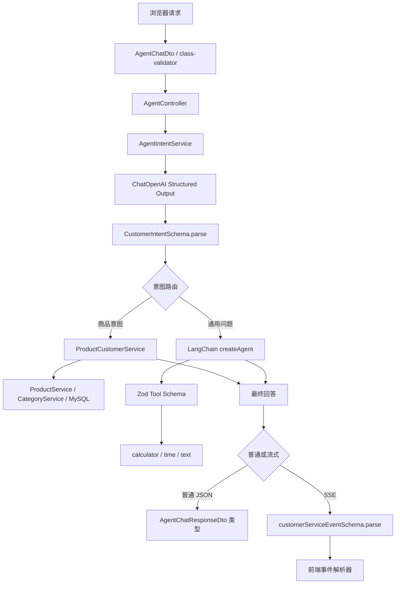

# Server Agent Zod 项目实战学习指南

> 适用项目：`server/src/agent`
>
> 当前基线：Node.js `>= 20.19.0`、TypeScript、NestJS 10、LangChain.js 1.5.5、LangGraph 1.4.9、Zod 4.4.3。
>
> 学习目标：不是只会写 `z.string()`，而是能解释 Zod 在当前 Agent 的 Tool Calling、Structured Output、SSE 协议、类型推导和安全边界中分别解决了什么问题。

---

## 目录

1. [先用一句话理解 Zod](#一先用一句话理解-zod)
2. [当前项目全景](#二当前项目全景)
3. [为什么 Agent 项目尤其需要 Zod](#三为什么-agent-项目尤其需要-zod)
4. [项目配置逐项解读](#四项目配置逐项解读)
5. [Zod 基础语法与项目对应关系](#五zod-基础语法与项目对应关系)
6. [实战一：Tool 参数 Schema](#六实战一tool-参数-schema)
7. [实战二：模型 Structured Output](#七实战二模型-structured-output)
8. [实战三：SSE 流事件协议](#八实战三sse-流事件协议)
9. [TypeScript、class-validator、Zod、TypeORM 的职责边界](#九typescriptclass-validatorzodtypeorm-的职责边界)
10. [一次真实请求中 Zod 的完整调用链](#十一次真实请求中-zod-的完整调用链)
11. [错误处理、调试和 ZodError](#十一错误处理调试和-zoderror)
12. [如何测试 Schema](#十二如何测试-schema)
13. [当前项目的优点、边界与改进方向](#十三当前项目的优点边界与改进方向)
14. [推荐的进阶改造示例](#十四推荐的进阶改造示例)
15. [七天学习与练习计划](#十五七天学习与练习计划)
16. [自测题与参考答案](#十六自测题与参考答案)
17. [速查表](#十七速查表)
18. [阅读顺序与验收标准](#十八阅读顺序与验收标准)

---

## 一、先用一句话理解 Zod

Zod 是一套“运行时数据契约”：先用 Schema 描述合法数据，再在程序真正运行时检查外部数据，最后还能从同一份 Schema 推导 TypeScript 类型。

当前项目最典型的代码是：

```ts
import { z } from 'zod';

const UserSchema = z.object({
  name: z.string().min(1),
  age: z.number().int().nonnegative(),
});

type User = z.infer<typeof UserSchema>;

const user = UserSchema.parse({
  name: '小明',
  age: 18,
});
```

这一小段同时完成三件事：

1. `UserSchema` 是数据说明书。
2. `UserSchema.parse(...)` 是运行时检查员。
3. `z.infer<typeof UserSchema>` 是 TypeScript 类型生成器。

### 1.1 TypeScript 为什么不能替代 Zod

下面的写法只有编译期类型，没有运行时校验：

```ts
type User = {
  name: string;
  age: number;
};

const data = JSON.parse(rawText) as User;
```

`as User` 的含义不是“请检查它确实是 User”，而是“程序员告诉 TypeScript，把它当成 User”。如果 `rawText` 实际是：

```json
{
  "name": 123,
  "age": "十八"
}
```

TypeScript 在运行时不会拦截。Zod 会：

```ts
const data = UserSchema.parse(JSON.parse(rawText));
```

因此可以记住：

```text
TypeScript 类型 = 开发时约束自己写的代码
Zod Schema     = 运行时验证真正收到的数据
```

### 1.2 Agent 项目中的“不可信输入”不只来自用户

普通 Web 项目通常重点验证 HTTP 请求。在 Agent 项目中，下列数据都应视为不可信：

- 浏览器提交的 JSON；
- 大模型生成的 Tool 参数；
- 大模型生成的结构化结果；
- Redis、数据库或消息队列中读取的历史 JSON；
- 第三方 API 返回值；
- 后端发给前端的流事件；
- 前端从网络收到并反序列化的事件。

大模型“看起来会返回 JSON”，不等于每一次都能返回符合程序要求的 JSON。Zod 的价值就是把自然语言世界与确定性程序世界隔开。

---

## 二、当前项目全景

### 2.1 Agent 模块代码地图

```text
server/src/agent
├── agent.module.ts                         NestJS 模块与依赖注入
├── agent.controller.ts                     普通聊天与 SSE HTTP 入口
├── agent.dto.ts                            HTTP 请求校验，使用 class-validator
├── agent-model.factory.ts                  ChatOpenAI 配置与实例复用
├── agent.tools.ts                          LangChain Tool + Zod 参数 Schema
├── agent.intent.ts                         意图 Structured Output 的 Zod Schema
├── agent.intent.service.ts                 调模型并解析结构化意图
├── agent.service.ts                        总路由、通用 Agent、Tool、流式调用
├── product-customer.service.ts             确定性的商品业务查询
├── conversation/
│   ├── agent.conversation.ts               多轮业务状态、字段合并规则
│   └── agent.conversation.service.ts       内存 Map + 30 分钟 TTL
├── persistence/
│   ├── agent-chat-application.service.ts   普通聊天的应用层编排
│   ├── agent-checkpointer.service.ts       MemorySaver / RedisSaver
│   ├── agent-history.service.ts            MySQL 会话与消息历史
│   └── *.entity.ts                         TypeORM 实体
└── stream/
    ├── agent.stream-protocol.ts            SSE 事件 Zod 协议
    ├── agent.stream-application.service.ts 流式执行与持久化编排
    └── agent.stream-sse.ts                 SSE 文本编码与背压处理
```

### 2.2 当前架构中的三条处理路线



### 2.3 Zod 在项目中的三个真实落点

| 使用位置 | 文件 | 验证对象 | 目的 |
| --- | --- | --- | --- |
| Tool 参数 | `agent.tools.ts` | 模型准备传给工具的参数 | 防止错误类型、非法枚举、过长文本进入工具函数 |
| Structured Output | `agent.intent.ts`、`agent.intent.service.ts` | 模型返回的客服意图对象 | 把自由文本转成可路由、可测试的确定结构 |
| SSE 事件协议 | `stream/agent.stream-protocol.ts` | 服务端准备发给前端的每个事件 | 保证事件类型、公共字段和各事件载荷合法 |

另外，`z.infer` 还让 Schema 成为 TypeScript 类型的唯一来源，减少 Schema 与手写类型漂移。

---

## 三、为什么 Agent 项目尤其需要 Zod

### 3.1 大模型输出是概率结果

传统函数通常有明确签名：

```ts
function add(left: number, right: number): number
```

模型则可能生成：

```json
{ "left": 10, "right": 20, "operation": "add" }
```

也可能生成：

```json
{ "a": "10", "b": 20, "operation": "plus" }
```

或者漏字段、增加字段、输出无法解析的内容。Schema 把模型的可能性空间缩小为程序接受的有限集合。

### 3.2 Zod Schema 也是给模型看的工具说明

在 LangChain Tool 中：

```ts
schema: z.object({
  operation: z.enum(['add', 'subtract', 'multiply', 'divide']),
  left: z.number(),
  right: z.number(),
})
```

这份 Schema 有两层用途：

1. LangChain 将结构描述提供给模型，让模型知道应该生成哪些参数。
2. 真正执行工具前，运行时会依据 Schema 验证参数。

所以 Tool Schema 既是“提示词的一部分”，也是“执行前的安全门”。

### 3.3 结构合法不等于业务可信

下面的对象完全可能通过 Zod：

```json
{
  "intent": "order_status",
  "confidence": 0.99,
  "entities": {
    "productName": null,
    "categoryName": null,
    "orderNo": "ORDER-OTHER-USER",
    "budgetMax": null,
    "quantity": null,
    "reason": null
  },
  "missingFields": [],
  "normalizedQuery": "查询订单状态"
}
```

Zod 只能证明：

- `intent` 在允许的枚举中；
- `confidence` 是 0～1 的数字；
- `orderNo` 是字符串；
- 其他字段形状正确。

它不能证明：

- 订单真实存在；
- 订单属于当前登录用户；
- 用户有查看权限；
- `confidence: 0.99` 真的是 99% 正确概率；
- 模型没有从上下文中猜测订单号。

正确的生产链路应该是：

```text
Zod 结构校验
→ 身份认证
→ 权限与数据归属校验
→ 业务规则校验
→ 参数化数据库查询
→ 输出脱敏
```

---

## 四、项目配置逐项解读

### 4.1 `server/package.json`

与 Zod/Agent 直接相关的依赖如下：

```json
{
  "engines": {
    "node": ">=20.19.0"
  },
  "dependencies": {
    "@langchain/core": "^1.2.5",
    "@langchain/langgraph": "^1.4.9",
    "@langchain/langgraph-checkpoint-redis": "^1.0.10",
    "@langchain/openai": "^1.5.6",
    "@nestjs/config": "^4.0.3",
    "langchain": "^1.5.5",
    "zod": "^4.4.3"
  }
}
```

当前锁文件和本地安装解析到的 Zod 版本是 `4.4.3`。

#### `^4.4.3` 的含义

`^4.4.3` 通常允许安装兼容的 4.x 新版本。团队协作和 CI 中应提交并使用同一种锁文件，避免不同环境解析到不同小版本。

当前仓库的 `server` 同时存在 `package-lock.json` 与 `pnpm-lock.yaml`。日常应明确统一使用 npm 还是 pnpm，不要交替更新两个锁文件，否则排查依赖差异会变困难。现有学习文档和脚本主要使用 pnpm 命令。

#### 为什么 LangChain 与 Zod 是配套关系

LangChain 使用 Zod Schema 描述 Tool 输入和 Structured Output。可以这样理解：

```text
LangChain 负责 Agent 执行流程
ChatOpenAI 负责调用模型
Zod 负责结构契约与运行时验证
NestJS 负责 HTTP、依赖注入与异常响应
TypeORM 负责数据库实体和持久化
```

### 4.2 `server/tsconfig.json`

重要选项：

```json
{
  "compilerOptions": {
    "module": "commonjs",
    "target": "ES2021",
    "strictNullChecks": true,
    "noImplicitAny": true,
    "strictBindCallApply": true,
    "skipLibCheck": true
  }
}
```

#### `strictNullChecks: true`

这对当前 Schema 很重要。以商品名称为例：

```ts
productName: z.string().nullable()
```

推导类型是：

```ts
string | null
```

开启 `strictNullChecks` 后，代码必须显式处理 `null`：

```ts
const productName = analysis.entities.productName?.trim();
```

如果关闭严格空值检查，`null` 很容易在类型系统中失去约束，Zod 推导类型的价值会被削弱。

#### `noImplicitAny: true`

未标明且无法推断的参数不能悄悄变成 `any`。配合 `z.infer`，工具参数、意图对象和事件对象都能保持强类型。

#### `skipLibCheck: true`

跳过依赖包 `.d.ts` 的完整类型检查，可以缩短构建时间，但不会跳过项目自己的 TypeScript 检查，也不会影响 Zod 在运行时执行 `parse`。

#### `module: commonjs`

项目使用 CommonJS 编译目标，但 TypeScript 仍可写：

```ts
import { z } from 'zod';
```

编译器负责转换模块语法。

### 4.3 NestJS 配置与 AgentModule

`AppModule` 中：

```ts
ConfigModule.forRoot({
  envFilePath: join(process.cwd(), '.env'),
  isGlobal: true,
})
```

这表示：

- `.env` 的解析路径基于启动时的 `process.cwd()`；
- 通常需要在 `server` 目录启动；
- `ConfigService` 可在全局模块中注入；
- 当前没有通过 Zod 或 Joi 配置 `validate`，所以环境变量只被读取，没有统一的启动期 Schema 校验。

`AgentModule` 注册了：

```text
AgentModelFactory
AgentIntentService
ProductCustomerService
AgentService
AgentConversationService
AgentHistoryService
AgentChatApplicationService
AgentCheckpointerService
AgentStreamApplicationService
```

Zod Schema 自身不是 Nest Provider。它们是普通的不可变模块常量，直接 import 即可。

### 4.4 模型环境变量

`AgentModelFactory` 读取：

| 变量 | 是否必需 | 作用 | 当前行为 |
| --- | --- | --- | --- |
| `OPENAI_API_KEY` | 是 | 模型服务认证 | 缺失时抛 `ServiceUnavailableException` |
| `OPENAI_MODEL` | 否 | 模型名称 | 空值回退为 `gpt-4.1-mini` |
| `OPENAI_BASE_URL` | 否 | OpenAI 兼容服务地址 | 非空时传给 `ChatOpenAI.configuration.baseURL` |

模型固定配置：

```ts
new ChatOpenAI({
  apiKey,
  model: this.getModelName(),
  temperature: 0,
});
```

`temperature: 0` 有助于降低输出随机性，但不能代替 Schema。即使温度为 0，模型调用仍可能因为供应商兼容性、提示词、上下文、模型升级或网络响应而产生不合法结构。

### 4.5 Checkpointer 配置

`AgentCheckpointerService` 还读取：

```dotenv
AGENT_CHECKPOINT_REDIS_URL=redis://localhost:6379
```

- 未配置：使用进程内 `MemorySaver`；
- 已配置：使用 `RedisSaver`；
- Redis checkpoint 默认 TTL 为 24 小时，读取时刷新。

注意：当前 `server/.env.example` 尚未列出 `AGENT_CHECKPOINT_REDIS_URL`。部署或学习 Redis Checkpointer 时需要自行补充。它与普通 `REDIS_URL` 不是同一个配置键。

### 4.6 三种“记忆”不要混淆

| 层 | 当前实现 | 保存内容 | 生命周期 |
| --- | --- | --- | --- |
| Agent Checkpointer | MemorySaver 或 RedisSaver | 通用 Agent 消息/线程 State | 进程期或 Redis TTL |
| 业务补字段状态 | `Map<string, AgentConversationState>` | pendingIntent、entities、missingFields | 30 分钟，进程重启丢失 |
| 长期聊天历史 | MySQL + TypeORM | 用户消息、助手消息、metadata | 数据库长期保存 |

目前只有 Structured Output 和流事件显式使用 Zod；业务 Map 状态和数据库 `metadata` 尚未在读写边界使用 Zod。

---

## 五、Zod 基础语法与项目对应关系

### 5.1 `z.object()`：对象结构

```ts
const ProductSchema = z.object({
  name: z.string(),
  price: z.number(),
});
```

合法：

```ts
ProductSchema.parse({ name: '无线耳机', price: 299 });
```

非法：

```ts
ProductSchema.parse({ name: '无线耳机', price: '299' });
```

当前项目中 `CustomerEntitiesSchema`、`CustomerIntentSchema` 和 `baseEventSchema` 都是对象 Schema。

默认的 `z.object()` 会在解析结果中移除未知键。如果安全边界要求“出现任何未声明字段都报错”，可以使用严格对象策略，例如 Zod 4 的 `z.strictObject({...})`。是否严格要按协议需要决定：

- 接受上游向前兼容字段：默认剥离未知键可能更友好；
- 安全协议、签名内容、强约束配置：严格拒绝更清晰。

### 5.2 `z.string()`：字符串

项目使用的字符串约束：

```ts
z.string().min(1)
z.string().max(200)
z.string().uuid()
z.string().datetime()
z.string().nullable()
z.string().default('Asia/Shanghai')
```

注意：`z.string()` 只保证值是字符串，不保证非空。

```ts
z.string().parse('');        // 合法
z.string().min(1).parse(''); // 非法
```

如果空格也应视为空，先做 trim：

```ts
const NonBlankTextSchema = z.string().trim().min(1);
```

当前 Tool 的 `transform_text` 对 `text` 使用了 `.min(1)`，但没有 `.trim()`，这是有意可讨论的选择：因为 `trim` 本身就是该 Tool 支持的操作，输入纯空格有时可能正是用户要处理的原文本。

### 5.3 `z.number()`：数字

项目中的例子：

```ts
confidence: z.number().min(0).max(1)
budgetMax: z.number().nonnegative().nullable()
quantity: z.number().int().positive().nullable()
durationMs: z.number().int().nonnegative()
seq: z.number().int().positive()
```

含义：

| 写法 | 接受范围 |
| --- | --- |
| `.min(0)` | 大于等于 0 |
| `.max(1)` | 小于等于 1 |
| `.nonnegative()` | 大于等于 0 |
| `.positive()` | 大于 0 |
| `.int()` | 整数 |

Zod 默认不会把字符串 `'300'` 自动变成数字 `300`。如果确实需要表单转换，可以显式使用预处理或 coercion，但 Agent Tool 参数一般应保持严格，不建议无条件吞掉模型类型错误。

### 5.4 `z.enum()`：有限枚举

```ts
const OperationSchema = z.enum([
  'add',
  'subtract',
  'multiply',
  'divide',
]);
```

它同时得到：

- 运行时允许值集合；
- 给模型看的参数选择范围；
- TypeScript 联合类型。

```ts
type Operation = z.infer<typeof OperationSchema>;
// 'add' | 'subtract' | 'multiply' | 'divide'
```

项目的意图、缺失字段、流状态、错误码都适合用枚举，因为它们是协议中的有限状态。

### 5.5 `z.literal()`：固定字面量

流协议中：

```ts
version: z.literal(1)
type: z.literal('run_started')
```

`literal` 比 `number()` 或 `string()` 更严格：值必须恰好等于指定字面量。

`version: 1` 是协议版本，不是任意数字。`type: 'run_started'` 也是判别联合的标签。

### 5.6 `z.array()`：数组

```ts
missingFields: z.array(MissingFieldSchema)
```

这会验证：

1. 外层必须是数组；
2. 每个元素都必须属于 `MissingFieldSchema` 枚举。

它不会自动保证不重复。如果协议不允许重复，可以增加业务校验或 refinement。

### 5.7 `.nullable()`、`.optional()`、`.default()` 的区别

这是 Agent 结构化输出最容易混淆的地方。

```ts
const A = z.string().nullable();
// string | null；字段必须存在，但值可以是 null

const B = z.string().optional();
// string | undefined；对象字段可以缺失

const C = z.string().default('default');
// 输入缺失或 undefined 时产生默认值
```

当前意图实体统一用 `.nullable()`：

```ts
productName: z.string().nullable()
```

这是很好的 Structured Output 设计，因为模型必须明确返回每个字段：

```json
{
  "productName": null
}
```

而不是一会儿省略字段、一会儿返回 `null`，导致下游出现两种“没有值”的表示方式。

当前时间 Tool 使用：

```ts
timeZone: z.string().default('Asia/Shanghai')
```

模型不传 `timeZone` 时，工具函数仍会收到默认值。

### 5.8 `.describe()`：给人和模型的语义说明

```ts
productName: z
  .string()
  .nullable()
  .describe('用户明确提到的商品名称，未提到时为 null')
```

类型系统只知道它是 `string | null`，不知道这个字符串的业务语义。`.describe()` 补充了：

- 字段表示什么；
- 什么时候应填值；
- 什么时候返回 null；
- 不允许模型做什么。

在 Structured Output 和 Tool Calling 中，字段描述会影响模型填参质量。好的描述应短、明确、可执行，避免塞进互相矛盾的长提示词。

### 5.9 `.extend()`：复用公共字段

流事件都有相同的公共字段，所以项目先定义：

```ts
const baseEventSchema = z.object({
  version: z.literal(1),
  runId: z.string().uuid(),
  conversationId: z.string().uuid(),
  turnId: z.string().uuid(),
  seq: z.number().int().positive(),
  timestamp: z.string().datetime(),
});
```

再扩展：

```ts
baseEventSchema.extend({
  type: z.literal('assistant_delta'),
  delta: z.string().min(1),
})
```

好处是公共字段只定义一次，不会在九种事件中复制九遍。

### 5.10 `z.discriminatedUnion()`：判别联合

```ts
z.discriminatedUnion('type', [
  RunStartedSchema,
  StatusSchema,
  AssistantDeltaSchema,
]);
```

Zod 先查看 `type`，再选择对应分支。它非常适合：

- SSE/WebSocket 事件；
- Redux Action；
- 消息队列事件；
- 工作流节点状态；
- API 的多种成功/失败结果。

TypeScript 也能根据 `event.type` 自动缩小类型：

```ts
function consume(event: CustomerServiceEvent) {
  if (event.type === 'assistant_delta') {
    event.delta; // string
  }
}
```

### 5.11 `parse()` 与 `safeParse()`

#### `parse`

```ts
const result = Schema.parse(input);
```

- 成功：返回验证后的数据；
- 失败：抛出 `ZodError`；
- 适合“失败就应中断当前流程”的边界。

当前项目在模型意图和事件工厂中使用 `parse()`。

#### `safeParse`

```ts
const result = Schema.safeParse(input);

if (result.success) {
  console.log(result.data);
} else {
  console.log(result.error.issues);
}
```

- 不抛异常；
- 返回判别联合；
- 适合表单提示、批处理、测试非法输入、需要自行映射错误的 API。

当前 `agent.intent.spec.ts` 使用 `safeParse()` 断言非法枚举和越界 confidence 会被拒绝。

### 5.12 `z.infer`、`z.input` 与 `z.output`

项目当前使用：

```ts
export type CustomerIntent = z.infer<typeof CustomerIntentSchema>;
```

当 Schema 没有转换时，`z.infer` 通常就是解析后的输出类型。

有默认值或 transform 时，输入和输出可能不同：

```ts
const TimeInputSchema = z.object({
  timeZone: z.string().default('Asia/Shanghai'),
});

type RawInput = z.input<typeof TimeInputSchema>;
// timeZone 可以不提供

type ParsedOutput = z.output<typeof TimeInputSchema>;
// timeZone 一定是 string
```

需要精确表达解析前/解析后类型时，优先使用 `z.input` 和 `z.output`，不要强行手写两个重复接口。

---

## 六、实战一：Tool 参数 Schema

文件：`server/src/agent/agent.tools.ts`

### 6.1 Tool 的组成

当前项目的注释非常准确：

```text
Tool = 普通函数 + 给模型看的使用说明 + Zod 参数规则
```

LangChain Tool 的简化结构：

```ts
tool(
  asyncOrSyncFunction,
  {
    name: '稳定的机器名称',
    description: '什么时候应该调用',
    schema: z.object({ /* 参数 */ }),
  },
)
```

三部分各有不同职责：

| 部分 | 面向谁 | 作用 |
| --- | --- | --- |
| `name` | 模型、日志、事件协议 | 唯一标识工具，应该稳定、简短、使用机器友好命名 |
| `description` | 模型 | 告诉模型何时调用、工具做什么、不做什么 |
| `schema` | 模型 + 运行时 | 说明参数并验证模型生成的参数 |
| 执行函数 | 程序 | 真正完成确定性操作 |

### 6.2 `calculator` 逐行解读

Schema：

```ts
schema: z.object({
  operation: z
    .enum(['add', 'subtract', 'multiply', 'divide'])
    .describe('要执行的运算'),
  left: z.number().describe('左操作数'),
  right: z.number().describe('右操作数'),
})
```

模型必须生成类似：

```json
{
  "operation": "multiply",
  "left": 125,
  "right": 8
}
```

Schema 拒绝：

```json
{
  "operation": "乘法",
  "left": "125",
  "right": 8
}
```

为什么 operation 应该用枚举，而不是普通字符串：

```ts
operation: z.string()
```

如果使用普通字符串，执行函数的 `switch` 只认识四个英文值，模型却可能生成 `plus`、`sum`、`乘法`。枚举让模型说明和程序分支保持一致。

为什么“除数不能为 0”没有只交给 Zod：

```ts
case 'divide':
  if (right === 0) {
    return '计算失败：除数不能为 0。';
  }
```

因为 `right === 0` 只在 `operation === 'divide'` 时非法。它是跨字段业务关系，不是 `right` 字段自身永远不能为 0。可以用 `.superRefine()` 表达，但当前放在执行函数中更直观，也能给用户返回友好工具结果。

为什么还检查 `Number.isFinite(result)`：

```ts
if (!Number.isFinite(result)) {
  return '计算失败：结果不是有限数字。';
}
```

Schema 验证输入不代表运算结果一定适合返回。输出也需要业务保护。

### 6.3 `transform_text` 逐行解读

```ts
schema: z.object({
  operation: z.enum(['uppercase', 'lowercase', 'trim', 'reverse']),
  text: z
    .string()
    .min(1, 'text 不能为空')
    .max(1000, 'text 不能超过 1000 个字符')
    .describe('需要处理的原始文本'),
})
```

这里体现了资源保护：即使文本转换本身很简单，也不应让模型向工具传无限长度的字符串。

`.min(1, '...')` 和 `.max(1000, '...')` 中的字符串是自定义错误消息。Schema 失败时，底层错误信息更容易定位到业务含义。

`reverse` 使用：

```ts
Array.from(text).reverse().join('')
```

比简单的 `text.split('')` 更适合处理部分 Unicode 字符。这不是 Zod 的职责，但说明“参数合法”和“算法正确”是两层问题。

### 6.4 `get_current_time` 逐行解读

```ts
schema: z.object({
  timeZone: z
    .string()
    .default('Asia/Shanghai')
    .describe('IANA 时区名称，例如 Asia/Shanghai'),
})
```

Zod 在这里保证 `timeZone` 是字符串，并在缺失时补默认值，但没有证明它是有效 IANA 时区。

因此执行函数仍有：

```ts
try {
  return new Intl.DateTimeFormat('zh-CN', { timeZone }).format(new Date());
} catch {
  return `无法识别时区 ${timeZone}...`;
}
```

这再次说明：

```text
字段形状校验 != 领域有效性校验
```

如果未来想在工具执行前就拒绝非法时区，可以增加 refinement，但仍应保留执行期异常处理，因为平台时区数据和运行环境也可能出错。

### 6.5 Tool 是如何注册到 Agent 的

```ts
export function createAgentTools() {
  return [calculatorTool, currentTimeTool, transformTextTool];
}
```

随后在 `AgentService.getAgent()`：

```ts
this.agent = createAgent({
  name: 'fe_assistant',
  model,
  checkpointer: this.checkpointerService.get(),
  tools: createAgentTools(),
  systemPrompt: '...',
});
```

完整过程：

```text
用户：“帮我算 125 × 8”
→ createAgent 把 Tool 的 name/description/schema 提供给模型
→ 模型选择 calculator
→ 模型生成 { operation: 'multiply', left: 125, right: 8 }
→ Zod 验证参数
→ calculator 执行函数得到 '1000'
→ 工具结果回到 Agent
→ 模型组织最终中文回答
```

### 6.6 为什么商品查询没有做成 Tool

当前 `createAgentTools()` 只注册三个通用工具。商品搜索、价格、库存走：

```text
CustomerIntentSchema
→ AgentService 确定性路由
→ ProductCustomerService
→ ProductService / CategoryService
```

这是当前项目的架构选择：同一能力只保留一个入口，避免“意图路由”和“自由 Agent Tool”同时争抢商品请求。

它不是说商品永远不能做 Tool。未来如果改为统一 Tool Agent，需要同时解决：

- 当前登录身份如何注入工具上下文；
- 商品查询参数 Schema；
- 数据权限和最大查询范围；
- 超时、重试、熔断；
- 结果长度和敏感字段脱敏；
- Tool 与确定性路由的唯一归属。

---

## 七、实战二：模型 Structured Output

文件：

- `server/src/agent/agent.intent.ts`
- `server/src/agent/agent.intent.service.ts`

### 7.1 为什么不让模型直接返回一句分类文本

最简单的意图识别可能要求模型只返回：

```text
inventory_query
```

但真实客服还需要：

- 主要意图；
- 置信度；
- 商品名、分类、订单号、预算、数量、原因；
- 缺失字段；
- 标准化后的请求。

因此项目定义完整对象：

```ts
CustomerIntentSchema = {
  intent,
  confidence,
  entities,
  missingFields,
  normalizedQuery,
}
```

### 7.2 `CustomerIntentNameSchema`

```ts
export const CustomerIntentNameSchema = z.enum([
  'product_search',
  'inventory_query',
  'price_query',
  'order_status',
  'refund_request',
  'complaint',
  'human_handoff',
  'general_chat',
  'unknown',
]);
```

这是一份协议白名单。增加一种意图不是只加一个字符串，还应同步考虑：

1. System Prompt 是否能清楚区分它；
2. 哪些实体是必需字段；
3. `calculateMissingFields()` 是否需要新规则；
4. `AgentService` 路由到哪个业务服务；
5. 测试是否覆盖混淆样例；
6. 是否有权限或写操作风险。

### 7.3 `CustomerEntitiesSchema`

| 字段 | Schema | 推导类型 | 业务含义 |
| --- | --- | --- | --- |
| `productName` | `z.string().nullable()` | `string \| null` | 用户明确说出的商品名 |
| `categoryName` | `z.string().nullable()` | `string \| null` | 用户明确说出的分类名 |
| `orderNo` | `z.string().nullable()` | `string \| null` | 用户明确提供的订单号 |
| `budgetMax` | `z.number().nonnegative().nullable()` | `number \| null` | 最高预算，不能为负数 |
| `quantity` | `z.number().int().positive().nullable()` | `number \| null` | 数量，必须为正整数 |
| `reason` | `z.string().nullable()` | `string \| null` | 退款或投诉原因 |

为什么全部字段存在、缺失时使用 `null`：

- 下游对象形状稳定；
- 数据库 metadata 更一致；
- 多轮 `mergeEntities()` 更容易实现；
- Prompt 可明确要求模型“不知道就填 null”；
- 避免同时处理“键不存在”“undefined”“null”三种情况。

为什么 `budgetMax` 可以是 0，而 `quantity` 不能是 0：

- 预算在类型层只规定非负；是否接受 0 元需求可由业务决定；
- 商品数量 0 通常不构成有效购买数量，所以要求正整数。

### 7.4 `MissingFieldSchema`

```ts
export const MissingFieldSchema = z.enum([
  'productName',
  'categoryName',
  'orderNo',
  'budgetMax',
  'quantity',
  'reason',
]);
```

它让模型只能声明已知实体字段为缺失项，不能返回：

```json
{ "missingFields": ["手机型号"] }
```

但当前生产路由没有直接相信模型给出的 `missingFields`，而是在 `agent.conversation.ts` 中重新依据业务规则计算：

```ts
const REQUIRED_FIELDS = {
  inventory_query: ['productName'],
  price_query: ['productName'],
};
```

```ts
calculateMissingFields(activeIntent, mergedEntities)
```

这是非常重要的设计：模型的 `missingFields` 可以用于观察和辅助，但业务代码才是必填规则的权威来源。

### 7.5 `CustomerIntentSchema`

```ts
export const CustomerIntentSchema = z.object({
  intent: CustomerIntentNameSchema,
  confidence: z.number().min(0).max(1),
  entities: CustomerEntitiesSchema,
  missingFields: z.array(MissingFieldSchema),
  normalizedQuery: z.string(),
});
```

这个 Schema 能保证“结构闭合”，但不能自动保证跨字段一致性。例如下面的数据仍可能通过：

```json
{
  "intent": "inventory_query",
  "confidence": 0.95,
  "entities": {
    "productName": null,
    "categoryName": null,
    "orderNo": null,
    "budgetMax": null,
    "quantity": null,
    "reason": null
  },
  "missingFields": [],
  "normalizedQuery": "查库存"
}
```

它的结构合法，但 `productName` 缺失时，业务规则认为 `missingFields` 应包含 `productName`。当前项目通过重新调用 `calculateMissingFields()` 修正这一点，而不是完全依赖模型自报。

### 7.6 `z.infer` 消除重复类型

```ts
export type CustomerIntentName = z.infer<
  typeof CustomerIntentNameSchema
>;

export type CustomerEntities = z.infer<
  typeof CustomerEntitiesSchema
>;

export type CustomerIntent = z.infer<
  typeof CustomerIntentSchema
>;
```

推荐做法是 Schema 在前，类型从 Schema 推导。

不推荐同时维护：

```ts
interface CustomerIntent { /* 一份 */ }
const CustomerIntentSchema = z.object({ /* 另一份 */ });
```

因为新增字段时很容易只改一份，造成：

```text
编译期以为字段存在
运行时 Schema 却删除或拒绝字段
```

### 7.7 `withStructuredOutput()` 的执行过程

```ts
const structuredModel = this.modelFactory
  .getModel()
  .withStructuredOutput(CustomerIntentSchema, {
    name: 'customer_intent',
  });
```

`name: 'customer_intent'` 是结构化输出的语义名称。随后：

```ts
const result = await structuredModel.invoke([
  { role: 'system', content: '...' },
  { role: 'user', content: message },
]);
```

可以把它理解为：

```text
普通 ChatOpenAI
→ 套上 CustomerIntentSchema 输出约束
→ 发送 System + User 消息
→ 模型供应商返回结构化结果
→ LangChain 解析
→ 项目再次 CustomerIntentSchema.parse(result)
```

### 7.8 为什么已经 `withStructuredOutput`，还要再次 `parse`

项目代码：

```ts
const parsed = CustomerIntentSchema.parse(result);
```

这是防御式边界：

- 明确保证 Service 返回值经过当前 Schema；
- 自定义 OpenAI Compatible 服务可能只兼容部分 Structured Output 能力；
- 后续替换模型封装时，Service 的运行时契约仍存在；
- 测试和日志定位更明确。

代价是重复验证一次，但意图对象很小，通常可以接受。

### 7.9 Structured Output 失败如何映射

`AgentIntentService` 捕获错误后：

```ts
throw new BadGatewayException(
  '客服意图识别失败，请检查模型是否支持 Structured Output',
);
```

含义：

- 缺少 API Key：保留为 503 `ServiceUnavailableException`；
- 模型响应、网络、结构解析、Zod 校验等失败：统一映射为 502 `BadGatewayException`。

这对用户比较友好，但开发调试时需要查看服务端日志中的原始 stack。日志中不应打印 API Key，也应谨慎记录完整用户敏感内容。

---

## 八、实战三：SSE 流事件协议

文件：`server/src/agent/stream/agent.stream-protocol.ts`

### 8.1 为什么流事件比普通 JSON 更需要契约

普通请求通常只返回一个完整对象。SSE 会连续返回多个事件：

```text
run_started
status
tool_started
tool_finished
assistant_delta
assistant_delta
assistant_final
done
```

只要中间一个事件格式错误，前端状态机就可能：

- 草稿内容重复；
- 工具状态永远停在执行中；
- 把 A 请求的 delta 写到 B 请求；
- 收不到终态，页面一直 loading；
- 无法按顺序重放或排错。

因此项目为每个事件建立 Zod 契约。

### 8.2 公共事件字段

```ts
const baseEventSchema = z.object({
  version: z.literal(1),
  runId: z.string().uuid(),
  conversationId: z.string().uuid(),
  turnId: z.string().uuid(),
  seq: z.number().int().positive(),
  timestamp: z.string().datetime(),
});
```

逐项含义：

| 字段 | 用途 | 为什么要校验 |
| --- | --- | --- |
| `version` | 协议版本 | 将来升级事件格式时可区分消费者能力 |
| `runId` | 一次流执行 ID | 过滤旧请求或并发请求事件 |
| `conversationId` | 会话 ID | 关联聊天线程与持久化数据 |
| `turnId` | 本轮服务端 ID | 关联一次用户-助手交互 |
| `seq` | 事件递增序号 | 检查顺序、重复、丢失 |
| `timestamp` | ISO 时间 | 日志关联、时延分析、重放 |

这里 `uuid()` 验证格式，`datetime()` 验证 ISO 日期时间字符串。它们并不证明 ID 已存在于数据库，也不证明客户端有权限访问这个会话。

### 8.3 九种事件

| `type` | 额外字段 | 作用 |
| --- | --- | --- |
| `run_started` | 无 | 流开始 |
| `status` | `stage`, `message` | 展示“理解中/工具中/回答中” |
| `assistant_delta` | `delta` | 增量文本草稿 |
| `tool_started` | `toolCallId`, `toolName`, `displayName` | 工具开始 |
| `tool_finished` | 上述 ID/名称、`summary`, `durationMs` | 工具结束与耗时 |
| `assistant_final` | `messageId`, `content`, `model`, `source` | 最终可持久化回答 |
| `run_failed` | `code`, `message`, `retryable` | 失败终态 |
| `run_cancelled` | `message` | 取消终态 |
| `done` | 无 | SSE 逻辑结束 |

### 8.4 为什么用 `type` 作为 discriminator

以 `assistant_delta` 为例：

```ts
baseEventSchema.extend({
  type: z.literal('assistant_delta'),
  delta: z.string().min(1),
})
```

当 `type` 是 `assistant_delta`，`delta` 必须存在且非空；当 `type` 是 `done`，不需要 `delta`。

如果使用一个大对象加大量 optional 字段：

```ts
z.object({
  type: z.string(),
  delta: z.string().optional(),
  message: z.string().optional(),
  toolName: z.string().optional(),
  // ...
})
```

就可能出现 `type: 'assistant_delta'` 却没有 `delta` 的“半合法对象”。判别联合更准确地表达事件状态机。

### 8.5 `CustomerServiceEvent` 类型

```ts
export type CustomerServiceEvent = z.infer<
  typeof customerServiceEventSchema
>;
```

它等价于九种事件的 TypeScript 联合。增加新事件分支后，类型自动更新。

### 8.6 `EventPayload` 条件类型

事件发送方不应该每次手动提供：

```text
version/runId/conversationId/turnId/seq/timestamp
```

所以代码从每个事件分支中移除公共字段：

```ts
export type EventPayload = CustomerServiceEvent extends infer Event
  ? Event extends CustomerServiceEvent
    ? Omit<Event, 'version' | 'runId' | 'conversationId' |
        'turnId' | 'seq' | 'timestamp'>
    : never
  : never;
```

这段是“分布式条件类型”。结果仍是联合：

```ts
{ type: 'run_started' }
| { type: 'status'; stage: ...; message: string }
| { type: 'assistant_delta'; delta: string }
| ...
```

因此调用者只传事件自己的载荷：

```ts
event({
  type: 'assistant_delta',
  delta,
});
```

### 8.7 `createEventFactory()` 为什么在发送前 parse

```ts
return customerServiceEventSchema.parse({
  version: 1,
  ...input,
  seq,
  timestamp: new Date().toISOString(),
  ...payload,
});
```

工厂同时完成：

1. 固定协议版本；
2. 注入 run/conversation/turn 标识；
3. 生成单调递增 seq；
4. 生成 ISO 时间；
5. Zod 运行时验证完整事件。

这属于“验证自己即将输出的数据”。不要误以为只有外部输入才值得校验；跨进程协议的生产者也应确保自己不发坏数据。

### 8.8 为什么 `seq` 从 1 开始

工厂初始：

```ts
let seq = 0;
```

每次先：

```ts
seq += 1;
```

Schema 又要求：

```ts
z.number().int().positive()
```

因此第一个事件序号是 1。这个约束与实现互相验证。

### 8.9 事件生成和 SSE 编码是两层

```text
createEventFactory
→ 产生已通过 Zod 的 CustomerServiceEvent 对象
→ encodeSse
→ 变成 id/event/data 文本帧
→ response.write
```

`encodeSse()` 不再负责字段合法性，它只负责传输格式：

```text
id: 1
event: run_started
data: {"version":1,"type":"run_started",...}

```

### 8.10 前端目前没有复用后端 Zod Schema

根前端 `src/agent-stream.ts` 当前：

- 手写 `CustomerServiceEvent` 联合类型；
- 手写 `parseCustomerServiceEvent()` 类型守卫；
- 手写每种事件字段检查。

这能工作，但存在双份协议：

```text
后端：Zod Schema
前端：TypeScript 联合 + 手写运行时守卫
```

当前后端约束比前端更严格。例如后端会检查 UUID、ISO datetime、字符串长度和错误码枚举，前端主要检查基础类型。

长期更推荐建立共享 package：

```text
packages/agent-contract
├── stream-event.schema.ts
├── chat.schema.ts
└── package.json
```

前后端都从同一份 Schema 导入类型和解析器，避免新增事件时漏改一端。共享包必须保持纯协议，不依赖 NestJS、TypeORM 或浏览器 UI。

---

## 九、TypeScript、class-validator、Zod、TypeORM 的职责边界

当前项目没有让 Zod 接管所有验证。理解“为什么并存”比强行统一工具更重要。

### 9.1 HTTP DTO：class-validator

`agent.dto.ts`：

```ts
export class AgentChatDto {
  @Transform(({ value }) =>
    typeof value === 'string' ? value.trim() : value
  )
  @IsString()
  @IsNotEmpty()
  @MaxLength(8000)
  message: string;

  @IsUUID('4')
  conversationId: string;

  @IsUUID('4')
  clientMessageId: string;
}
```

Controller 配置：

```ts
new ValidationPipe({
  whitelist: true,
  forbidNonWhitelisted: true,
  transform: true,
})
```

含义：

- `transform: true`：把请求体转换为 DTO 类实例，并执行 `@Transform`；
- `whitelist: true`：只允许 DTO 声明过的属性；
- `forbidNonWhitelisted: true`：额外字段不是静默删除，而是直接报 400；
- 装饰器失败由 NestJS 自动生成 400 响应。

这套方式与 NestJS 生态集成很好，所以 HTTP 层继续使用 class-validator 是合理的。

### 9.2 Agent 内部：Zod

Zod 更适合当前这些场景：

- LangChain Tool 原生接受 Zod Schema；
- `withStructuredOutput()` 原生接受 Zod Schema；
- 需要从 Schema 推导联合类型；
- SSE discriminated union 表达力强；
- 不依赖 class 实例和装饰器。

### 9.3 TypeScript 类型

例如：

```ts
export interface AgentChatResponseDto {
  reply: string;
  model: string;
  // ...
}
```

这个 interface 只检查项目代码如何构造返回值，不会在 HTTP 响应发出前自动执行运行时验证。

### 9.4 TypeORM 实体

TypeORM 装饰器定义数据库映射：

```ts
@Column({ type: 'varchar', length: 36 })
conversationId: string;
```

它主要负责：

- 表名、列名和数据库类型；
- 索引与唯一约束；
- 关联关系；
- 读写映射。

它不等于 API 输入 Schema，也不应把模型结果未经业务校验直接保存。

### 9.5 四者对比

| 工具 | 主要发生时间 | 能否运行时验证 | 当前用途 |
| --- | --- | --- | --- |
| TypeScript | 编译/开发期 | 否 | 项目内部静态类型 |
| class-validator | NestJS 请求运行时 | 是 | `AgentChatDto` HTTP 请求 |
| Zod | 任意运行时边界 | 是 | Tool、模型输出、SSE 协议 |
| TypeORM | 数据库读写期 | 部分依赖数据库约束 | 实体、列、关系、索引 |

### 9.6 一条实用判断规则

```text
浏览器 HTTP DTO 且已深度使用 NestJS ValidationPipe
→ class-validator

模型、Tool、事件、JSON 存储、跨包共享协议
→ Zod

只在项目内部传递且来源已可信
→ TypeScript 类型通常足够

数据库结构与关系
→ TypeORM + 数据库约束
```

---

## 十、一次真实请求中 Zod 的完整调用链

### 10.1 场景 A：查商品库存

请求：

```http
POST /api/agent/chat
Content-Type: application/json

{
  "message": "无线耳机还有多少库存？",
  "conversationId": "11111111-1111-4111-8111-111111111111",
  "clientMessageId": "22222222-2222-4222-8222-222222222222"
}
```

调用链：

```text
1. ValidationPipe
   - trim message
   - 检查非空、最大 8000 字符
   - 检查两个 UUID v4

2. AgentController.chat()
   → AgentChatApplicationService.chat()

3. MySQL
   - ensureConversation
   - startUserTurn(status=pending)

4. AgentService.chat()
   → AgentIntentService.analyze(message)

5. ChatOpenAI.withStructuredOutput(CustomerIntentSchema)
   模型尝试返回：
   {
     intent: 'inventory_query',
     confidence: 0.95,
     entities: { productName: '无线耳机', ... },
     missingFields: [],
     normalizedQuery: '查询无线耳机库存'
   }

6. CustomerIntentSchema.parse(result)
   - 枚举、数字范围、实体类型、数组逐项验证

7. mergeEntities()
   - 与上一轮实体合并

8. calculateMissingFields()
   - 由业务规则重新计算必填字段

9. ProductCustomerService.reply()
   - ProductService 查询真实数据库
   - 格式化库存回答

10. completeAssistantTurn()
    - 用户消息变 completed
    - 保存 assistant 最终消息与 metadata

11. 返回 JSON
```

这个场景不会调用 `calculatorTool` 等通用 Tool，因为商品请求走确定性业务路由。

### 10.2 场景 B：两轮补字段

第一轮：

```text
用户：“帮我查库存”
```

模型结构化输出可能是：

```json
{
  "intent": "inventory_query",
  "confidence": 0.95,
  "entities": {
    "productName": null,
    "categoryName": null,
    "orderNo": null,
    "budgetMax": null,
    "quantity": null,
    "reason": null
  },
  "missingFields": ["productName"],
  "normalizedQuery": "查询商品库存"
}
```

业务状态保存：

```ts
{
  status: 'collecting_fields',
  pendingIntent: 'inventory_query',
  entities: { productName: null, ... },
  missingFields: ['productName'],
}
```

第二轮：

```text
用户：“无线耳机”
```

即使当前模型把它分类为 `product_search`，`resolveIntent()` 发现：

- 上一轮正在收集字段；
- 新消息让缺失字段数量减少；
- 因此继续使用上一轮 `inventory_query`。

这里 Zod 保证每一轮提取对象的形状，业务状态机决定跨轮语义。

### 10.3 场景 C：计算并流式输出

请求：

```http
POST /api/agent/chat/stream
Accept: text/event-stream
```

调用链：

```text
AgentIntentService + CustomerIntentSchema
→ 判断为 general_chat
→ AgentService.getAgent()
→ createAgent.streamEvents()
→ 模型选择 calculator
→ calculator 的 Zod Schema 校验参数
→ 工具执行
→ LangChain 消息增量
→ createEventFactory 生成并用 Zod 验证每个 SSE 事件
→ encodeSse
→ 浏览器 ReadableStream
→ 前端 parseCustomerServiceEvent
→ AgentChat reducer/UI
```

可能收到：

```text
event: run_started
event: status
event: tool_started
event: tool_finished
event: assistant_delta
event: assistant_final
event: done
```

### 10.4 三次不同性质的验证

一次通用 Agent 流式请求可能经历：

```text
HTTP DTO 验证             用户 → NestJS
CustomerIntentSchema      模型 → 意图路由器
Tool Schema               模型 → 工具函数
SSE Event Schema          后端应用层 → 前端
前端事件守卫              网络 → UI 状态机
```

这不是重复劳动，而是在不同信任边界验证不同对象。

---

## 十一、错误处理、调试和 ZodError

### 11.1 `parse()` 失败时的结构

典型用法：

```ts
import { z, ZodError } from 'zod';

try {
  CustomerIntentSchema.parse(input);
} catch (error) {
  if (error instanceof ZodError) {
    console.error(error.issues);
  }
}
```

`issues` 中常见字段包括：

- `path`：错误字段路径，如 `['entities', 'quantity']`；
- `code`：错误类别；
- `message`：人类可读错误；
- 其他与错误类型相关的限制信息。

### 11.2 用 `safeParse()` 做可控错误映射

```ts
const parsed = CustomerIntentSchema.safeParse(input);

if (!parsed.success) {
  const summaries = parsed.error.issues.map((issue) => ({
    path: issue.path.join('.'),
    message: issue.message,
  }));

  // 只记录必要信息，不记录完整敏感输入
  logger.warn({ event: 'intent_schema_failed', issues: summaries });
}
```

生产日志建议记录：

- Schema 名称；
- issue path/code；
- runId/turnId；
- 模型名；
- 耗时；
- 是否可重试。

谨慎记录：

- 完整用户消息；
- 订单号、手机号、地址；
- 完整模型原始输出；
- 数据库查询结果。

绝不记录：

- API Key；
- JWT；
- 数据库密码；
- Redis 密码；
- 支付密钥。

### 11.3 常见 Zod 失败及定位

#### 失败 1：模型返回了未知意图

```text
path: intent
```

检查：

- 模型是否支持 Structured Output；
- Schema 是否正确传给兼容接口；
- Prompt 是否用了与枚举不一致的中文标签；
- 新增意图后是否忘记修改 Schema。

#### 失败 2：数字变成字符串

```json
{ "confidence": "0.9" }
```

检查：

- 上游是否真的使用结构化输出；
- 兼容服务是否返回 JSON 字符串包 JSON；
- 是否应该严格拒绝，而不是 `coerce`。

Agent 关键控制字段通常建议严格拒绝，避免错误悄悄被转换。

#### 失败 3：实体字段被省略

```json
{
  "entities": {
    "productName": "耳机"
  }
}
```

当前 Schema 要求其余字段都存在并为 null。检查 System Prompt 是否明确要求完整字段，模型供应商是否支持传入的 JSON Schema 能力。

#### 失败 4：事件 ID 不是 UUID

检查：

- 调用方是否使用 `randomUUID()`；
- 测试 fixture 是否是合法 UUID v4；
- 是否把数据库自增 ID 错当成 runId/turnId。

#### 失败 5：`assistant_delta` 是空字符串

后端 Schema 要求：

```ts
delta: z.string().min(1)
```

当前 `streamGeneralAgent()` 已经先判断：

```ts
if (delta) await stream.onDelta(delta);
```

这是生产代码与 Schema 约束互相匹配的例子。

### 11.4 不要把所有 Zod 失败都返回给终端用户

模型输出校验失败属于服务内部/上游网关问题，用户不需要看到：

```text
Invalid enum value at entities.quantity...
```

更合理的分层：

```text
服务端日志：详细 issues + runId
HTTP 用户响应：客服意图识别失败，请稍后重试
监控指标：schema_validation_failed_total
```

HTTP 请求 DTO 校验则可以返回更具体的字段错误，因为那是用户/前端可修正的输入。

---

## 十二、如何测试 Schema

### 12.1 当前已有测试

`agent.intent.spec.ts` 已覆盖：

1. 合法库存意图可以 parse；
2. 枚举外的意图被拒绝；
3. `confidence` 超出 0～1 被拒绝。

执行：

```bash
cd server
pnpm test -- agent.intent.spec.ts --runInBand
```

### 12.2 测试应该覆盖四类样例

#### A. 最小合法值

```ts
it('接受最小合法结果', () => {
  expect(() =>
    CustomerIntentSchema.parse({
      intent: 'unknown',
      confidence: 0,
      entities: emptyEntities,
      missingFields: [],
      normalizedQuery: '',
    }),
  ).not.toThrow();
});
```

这个测试也会暴露一个设计问题：当前 `normalizedQuery: z.string()` 接受空字符串。如果业务要求非空，应明确改成 `.trim().min(1)`。

#### B. 边界值

```ts
it.each([0, 1])('接受 confidence 边界 %s', (confidence) => {
  const result = CustomerIntentSchema.safeParse({
    intent: 'general_chat',
    confidence,
    entities: emptyEntities,
    missingFields: [],
    normalizedQuery: '你好',
  });

  expect(result.success).toBe(true);
});
```

#### C. 错误类型

```ts
it('拒绝字符串 quantity', () => {
  const result = CustomerIntentSchema.safeParse({
    intent: 'product_search',
    confidence: 0.8,
    entities: { ...emptyEntities, quantity: '2' },
    missingFields: [],
    normalizedQuery: '买两个耳机',
  });

  expect(result.success).toBe(false);
});
```

#### D. 业务上矛盾但结构合法

```ts
it('提醒：基础 Schema 不检查 missingFields 跨字段一致性', () => {
  const result = CustomerIntentSchema.safeParse({
    intent: 'inventory_query',
    confidence: 0.9,
    entities: emptyEntities,
    missingFields: [],
    normalizedQuery: '查库存',
  });

  expect(result.success).toBe(true);
});
```

这个测试不是要接受错误业务，而是明确记录 Schema 的职责边界。真正的业务测试应断言 `calculateMissingFields()` 会返回 `['productName']`。

### 12.3 Tool Schema 测试

当前工具常量没有导出，测试可以走 `createAgentTools()`，或把 Schema 提取为具名导出：

```ts
export const CalculatorInputSchema = z.object({
  operation: z.enum(['add', 'subtract', 'multiply', 'divide']),
  left: z.number(),
  right: z.number(),
});
```

然后测试：

```ts
describe('CalculatorInputSchema', () => {
  it('接受乘法参数', () => {
    expect(
      CalculatorInputSchema.parse({
        operation: 'multiply',
        left: 125,
        right: 8,
      }),
    ).toEqual({ operation: 'multiply', left: 125, right: 8 });
  });

  it('拒绝未知 operation', () => {
    expect(
      CalculatorInputSchema.safeParse({
        operation: 'power',
        left: 2,
        right: 8,
      }).success,
    ).toBe(false);
  });
});
```

### 12.4 流事件协议测试

建议至少覆盖：

- 工厂第一个 `seq` 为 1，之后递增；
- 所有事件共享相同 runId/conversationId/turnId；
- timestamp 是合法 datetime；
- `assistant_delta` 空字符串失败；
- `durationMs` 负数失败；
- `run_failed.code` 未知值失败；
- UUID 非法失败；
- 每种 `type` 的必填字段不能缺失。

示例：

```ts
it('事件工厂生成递增 seq', () => {
  const event = createEventFactory({
    runId: '11111111-1111-4111-8111-111111111111',
    conversationId: '22222222-2222-4222-8222-222222222222',
    turnId: '33333333-3333-4333-8333-333333333333',
  });

  expect(event({ type: 'run_started' }).seq).toBe(1);
  expect(event({
    type: 'status',
    stage: 'understanding',
    message: '正在理解',
  }).seq).toBe(2);
});
```

### 12.5 不要只测试 Schema

完整测试金字塔应包括：

```text
Schema 单元测试
→ 业务规则单元测试
→ Service 路由测试
→ Controller DTO/HTTP 测试
→ SSE 编码与分块解析测试
→ 少量真实模型契约测试
```

Schema 测试证明结构约束；它不能证明 Prompt 分类准确，也不能证明商品查询权限正确。

---

## 十三、当前项目的优点、边界与改进方向

### 13.1 当前做得好的地方

#### 1. Schema 是意图类型的唯一来源

`CustomerIntent`、`CustomerEntities`、`CustomerIntentName` 都通过 `z.infer` 生成，减少了手写类型漂移。

#### 2. 对模型输出做了二次 parse

即使使用 `withStructuredOutput()`，Service 仍明确执行 `CustomerIntentSchema.parse(result)`，边界清晰。

#### 3. 使用 `nullable` 统一缺失值

模型必须返回完整实体对象，缺失字段为 null，便于多轮合并。

#### 4. 业务必填规则不信任模型

`calculateMissingFields()` 由代码重新计算，模型不能自行决定业务是否具备执行条件。

#### 5. 流协议使用判别联合

比“大对象 + 大量 optional 字段”更能准确表达事件状态机。

#### 6. 事件在发送前运行时验证

`createEventFactory()` 不只依赖 TypeScript，而是对最终完整事件执行 parse。

#### 7. Tool 参数有限制

运算枚举、文本长度、数字类型都在进入工具函数前受到约束。

### 13.2 当前边界

#### 1. HTTP 请求不是 Zod

这是架构选择，不是错误。DTO 使用 NestJS 的 class-validator。学习时不要误以为所有输入都由 Zod 验证。

#### 2. 普通 JSON 响应没有运行时 Schema

`AgentChatResponseDto` 是 TypeScript interface。只要服务端代码绕过类型或数据库内容异常，HTTP 输出没有额外 parse。

是否需要增加响应 Schema 取决于契约风险。对外公共 API 或多客户端协议更值得增加；纯内部简单接口可依靠 TypeScript + e2e 测试。

#### 3. 业务会话 Map 状态没有 Zod

当前状态在同一进程内部创建和读取，风险较低。一旦迁移到 Redis，JSON 可能来自旧版本、人工修改、过期数据或其他服务，读取后应该 parse。

#### 4. MySQL `metadata` 是 `Record<string, unknown>`

写入时来自当前 `AgentChatResponseDto`，但读回后没有明确的版本化 Schema。长期审计、后台展示或数据迁移时可能出现结构漂移。

#### 5. 前后端流协议重复维护

后端 Zod 与前端手写联合/守卫需要同步修改，建议未来提取共享契约包。

#### 6. Schema 主要验证字段形状

`CustomerIntentSchema` 不检查 intent、entities、missingFields 的跨字段一致性。当前关键执行路径用确定性业务函数弥补。

#### 7. 环境变量缺少启动期 Schema

当前 API Key 在首次真正调用模型时才发现缺失；Redis URL、模型名、Base URL 也没有统一格式验证。

#### 8. Tool Schema 测试较少

现有测试主要覆盖意图 Schema，流协议与三个 Tool 的边界测试仍值得补齐。

### 13.3 发现的项目配置注意点

以下内容与学习 Zod 密切相关，但不建议在没有需求时直接大改：

1. `server/.env.example` 未列出 `AGENT_CHECKPOINT_REDIS_URL`。
2. 根前端没有安装/复用后端的 Zod 流事件 Schema。
3. `AgentChatResponseDto`、会话状态、数据库 metadata 尚无运行时 Schema。
4. `normalizedQuery` 当前允许空字符串。
5. `timeZone` 当前只验证字符串，真正的 IANA 合法性由 `Intl.DateTimeFormat` 执行时检查。
6. `missingFields` 的模型结果与 `entities` 可能矛盾；生产路由依靠业务函数重新计算。
7. 错误响应会把多种模型/Schema 失败统一为 502；排查必须依赖服务端日志和 run/turn 标识。

---

## 十四、推荐的进阶改造示例

> 本章是学习用方案，不表示当前任务已经修改这些生产代码。每次只做一个改造并补测试。

### 14.1 把 Tool Schema 提取成具名常量

当前 Schema 写在 `tool()` 配置内部，简洁但不方便直接单测和复用。

可以改为：

```ts
export const CalculatorInputSchema = z.object({
  operation: z
    .enum(['add', 'subtract', 'multiply', 'divide'])
    .describe('要执行的运算'),
  left: z.number().describe('左操作数'),
  right: z.number().describe('右操作数'),
});

type CalculatorInput = z.infer<typeof CalculatorInputSchema>;

const calculatorTool = tool(
  ({ operation, left, right }: CalculatorInput) => {
    // ...
  },
  {
    name: 'calculator',
    description: '...',
    schema: CalculatorInputSchema,
  },
);
```

收益：

- Schema 可以独立测试；
- 可以生成文档或 JSON Schema；
- 工具函数签名更容易阅读；
- 同一输入契约可被其他执行器复用。

### 14.2 对意图对象做跨字段校验

如果希望 Schema 本身检查 `missingFields` 一致性，可以使用 `.superRefine()`：

```ts
export const StrictCustomerIntentSchema = CustomerIntentSchema.superRefine(
  (value, ctx) => {
    const expected = calculateMissingFields(value.intent, value.entities);
    const actual = new Set(value.missingFields);

    for (const field of expected) {
      if (!actual.has(field)) {
        ctx.addIssue({
          code: 'custom',
          path: ['missingFields'],
          message: `${value.intent} 缺少 ${field} 时必须声明该字段`,
        });
      }
    }
  },
);
```

使用前要考虑：

- 这是模型输出 Schema 还是业务最终 Schema；
- 模型偶尔漏报时，是整个调用失败，还是由业务层修正更稳；
- `REQUIRED_FIELDS` 是否会造成模块循环依赖。

当前项目采用“基础结构 Schema + 业务层重算”，容错性更强。不要为了追求一个超大 Schema 而把所有业务规则塞进 Zod。

### 14.3 为业务会话状态定义 Schema

一旦状态进入 Redis，可定义：

```ts
export const ConversationStatusSchema = z.enum([
  'idle',
  'collecting_fields',
  'processing',
  'completed',
  'cancelled',
]);

export const AgentConversationStateSchema = z.object({
  version: z.literal(1),
  conversationId: z.string().uuid(),
  status: ConversationStatusSchema,
  pendingIntent: CustomerIntentNameSchema.nullable(),
  entities: CustomerEntitiesSchema,
  missingFields: z.array(MissingFieldSchema),
  createdAt: z.number().int().nonnegative(),
  updatedAt: z.number().int().nonnegative(),
  expiresAt: z.number().int().positive(),
});

export type AgentConversationState = z.infer<
  typeof AgentConversationStateSchema
>;
```

Redis 读路径：

```ts
const raw = await redis.get(key);
if (!raw) return null;

const parsedJson: unknown = JSON.parse(raw);
const state = AgentConversationStateSchema.parse(parsedJson);
```

关键原则：从 Redis 读回的 JSON 不是因为“由我们写入”就永久可信。服务版本升级、旧数据、人工操作、其他进程和序列化错误都可能破坏结构。

### 14.4 为环境变量做启动期验证

可以先定义：

```ts
const AgentEnvSchema = z.object({
  OPENAI_API_KEY: z.string().trim().min(1),
  OPENAI_MODEL: z.string().trim().min(1).default('gpt-4.1-mini'),
  OPENAI_BASE_URL: z
    .string()
    .trim()
    .url()
    .optional()
    .or(z.literal('')),
  AGENT_CHECKPOINT_REDIS_URL: z
    .string()
    .trim()
    .url()
    .optional(),
});
```

不过要先决定启动策略：

- 整个 server 没有 API Key 是否应该启动失败；
- 还是只有调用 Agent 时返回 503；
- Redis 是可选降级为 MemorySaver，还是生产环境强制；
- 自定义 Base URL 是否一定满足标准 URL 解析。

当前项目包含很多非 Agent 功能，所以“没有 API Key 仍允许服务启动、Agent 调用时返回 503”是有现实意义的降级策略。可以为生产环境和开发环境设计不同严格度。

### 14.5 为普通聊天响应定义 Schema

```ts
export const AgentChatResponseSchema = z.object({
  conversationId: z.string().uuid(),
  reply: z.string(),
  model: z.string().min(1),
  source: z.enum(['intent_router', 'agent']),
  intent: CustomerIntentNameSchema,
  entities: CustomerEntitiesSchema,
  status: ConversationStatusSchema,
  missingFields: z.array(MissingFieldSchema),
});

export type AgentChatResponseDto = z.infer<
  typeof AgentChatResponseSchema
>;
```

应用层返回前可选 parse：

```ts
return AgentChatResponseSchema.parse(result);
```

权衡：

- 优点：HTTP 契约有运行时保证，类型不重复；
- 代价：又增加一次解析，需设计错误映射；
- 如果前端共享 Schema，收益明显增加。

### 14.6 共享前后端流协议

理想结构：

```text
packages/agent-contract/
├── package.json
├── tsconfig.json
└── src/
    ├── chat.schema.ts
    ├── intent.schema.ts
    └── stream.schema.ts
```

后端：

```ts
import {
  customerServiceEventSchema,
  type CustomerServiceEvent,
} from '@fe/agent-contract';
```

前端：

```ts
const event = customerServiceEventSchema.parse(JSON.parse(data));
```

共享包不要导入：

- `@nestjs/common`；
- TypeORM 实体；
- Node 专属 API；
- React 组件；
- 服务端环境变量。

它只定义稳定、可序列化的协议。

### 14.7 版本化数据库 metadata

当前 assistant metadata 包含：

```ts
{
  source,
  intent,
  entities,
  status,
  missingFields,
  runId?,
}
```

可以定义：

```ts
const AgentMessageMetadataV1Schema = z.object({
  version: z.literal(1),
  source: z.enum(['intent_router', 'agent']),
  intent: CustomerIntentNameSchema,
  entities: CustomerEntitiesSchema,
  status: ConversationStatusSchema,
  missingFields: z.array(MissingFieldSchema),
  runId: z.string().uuid().optional(),
});
```

版本字段让未来迁移更清楚：

```ts
const MetadataSchema = z.discriminatedUnion('version', [
  MetadataV1Schema,
  MetadataV2Schema,
]);
```

### 14.8 Schema 命名约定

推荐：

```text
XxxSchema          完整领域/协议对象
XxxInputSchema     输入
XxxOutputSchema    输出
XxxEventSchema     事件
XxxParamsSchema    路径/查询参数
```

对应类型：

```ts
type Xxx = z.infer<typeof XxxSchema>;
type XxxInput = z.input<typeof XxxInputSchema>;
type XxxOutput = z.output<typeof XxxInputSchema>;
```

不要命名成 `schema1`、`dataSchema`，否则日志和测试很难定位。

---

## 十五、七天学习与练习计划

### 第 1 天：类型与运行时

目标：能解释 TypeScript 和 Zod 的根本区别。

任务：

- 阅读 `agent.intent.ts`；
- 手写一个最小 `ProductSchema`；
- 分别用 `as Product` 与 `ProductSchema.parse()` 处理错误 JSON；
- 观察一个“编译通过但运行错误”的案例；
- 练习 `parse` 和 `safeParse`。

验收：

- 能解释为什么 `unknown` 比 `any` 更适合外部数据；
- 能从 `safeParse` 的 success 分支拿到正确类型；
- 能读懂 `ZodError.issues[].path`。

### 第 2 天：基础 Schema

目标：掌握当前项目实际使用的 Zod API。

任务：

- 练习 object/string/number/array；
- 练习 enum/literal；
- 比较 nullable/optional/default；
- 练习 uuid/datetime/int/positive/nonnegative；
- 给每个字段增加有意义的 describe。

验收：

- 能准确说出 `z.string()` 是否接受空字符串；
- 能解释为什么实体字段选择 nullable；
- 能解释 `quantity: 0` 为什么失败。

### 第 3 天：Tool Calling

目标：看懂 `agent.tools.ts`。

任务：

- 给三个 Tool 的 Schema 各写至少三个测试；
- 测试未知 operation、错误数字类型、文本长度边界；
- 新增一个只读练习 Tool，例如单位换算；
- 限制枚举、数值范围与文本长度；
- 为执行期异常返回安全消息。

验收：

- 能解释 name、description、schema 各自影响什么；
- 能解释为什么 Tool 参数来自模型也不可信；
- 能区分 Schema 错误与执行函数业务错误。

### 第 4 天：Structured Output

目标：完整理解意图识别。

任务：

- 画出 `analyze()` 调用链；
- 为每一种 intent 写一条合法 fixture；
- 写五条非法 fixture；
- 测试 null、缺字段和多余字段；
- 观察 Compatible Base URL 不支持 Structured Output 时的 502。

验收：

- 能解释为什么使用 withStructuredOutput；
- 能解释为什么再次 parse；
- 能解释为什么 Zod 通过不代表意图判断正确。

### 第 5 天：多轮状态与业务规则

目标：理解 Schema 与状态机的分工。

任务：

- 阅读 `agent.conversation.ts`；
- 测试 mergeEntities：新 null 不覆盖旧值；
- 测试 inventory_query 缺 productName；
- 构造“模型 missingFields 错误但结构合法”的输入；
- 观察业务层如何重新计算。

验收：

- 能解释模型抽取字段和业务必填规则为什么分开；
- 能解释 Map 状态迁移 Redis 后为什么要 Zod parse；
- 能说出三种记忆的区别。

### 第 6 天：SSE 协议

目标：掌握判别联合和事件工厂。

任务：

- 为九种事件各构造一个合法对象；
- 为事件工厂写 seq 测试；
- 删除某个必填字段并观察 path；
- 测试非法 UUID、空 delta、负 duration；
- 对照前端 `src/agent-stream.ts` 找出校验强度差异。

验收：

- 能解释为什么事件需要 version/runId/turnId/seq；
- 能解释 `.extend()` 和 discriminatedUnion；
- 能在 switch 中利用 TypeScript 类型缩小。

### 第 7 天：生产化设计

目标：设计自己的 Agent 数据契约层。

任务：

- 设计共享 `agent-contract` package；
- 为环境变量设计 Schema 和降级策略；
- 为 Redis 状态增加 version；
- 为数据库 metadata 设计版本化 Schema；
- 设计日志字段与敏感信息规则；
- 执行 build 和目标测试。

验收：

- 能说清楚每个信任边界在哪里 parse；
- 能说明哪些业务规则不应该塞进 Zod；
- 能为一个新 Tool 从 Schema、实现、权限、测试到观测完成设计。

---

## 十六、自测题与参考答案

### 16.1 基础题

#### 题 1：`z.string()` 会拒绝空字符串吗？

不会。需要 `.min(1)`；若空格也算空，使用 `.trim().min(1)`。

#### 题 2：`nullable()` 与 `optional()` 有什么区别？

`nullable()` 允许值为 null，但对象键通常仍要存在；`optional()` 允许键缺失或值为 undefined。

#### 题 3：为什么意图实体使用 null 而不是 optional？

让模型每次返回固定形状，并统一“未提取到”的表达，便于下游合并、持久化和测试。

#### 题 4：`parse()` 和 `safeParse()` 如何选择？

失败应中断流程时用 parse；需要自己处理和展示错误时用 safeParse。测试非法样例常用 safeParse。

#### 题 5：`z.infer` 做什么？

从 Schema 推导解析后 TypeScript 类型，让 Schema 成为结构的唯一来源。

### 16.2 项目题

#### 题 6：当前项目哪三处核心代码使用 Zod？

`agent.tools.ts` 的 Tool 参数、`agent.intent.ts`/Service 的模型结构化输出、`agent.stream-protocol.ts` 的 SSE 事件协议。

#### 题 7：为什么 HTTP 请求又使用 class-validator？

项目已使用 NestJS DTO + ValidationPipe 生态；Zod 主要承担 LangChain 原生契约和跨进程事件协议。两者验证不同边界，可以并存。

#### 题 8：为什么 `withStructuredOutput()` 后还再次 parse？

提供明确的 Service 运行时边界，防御供应商兼容差异和未来实现变化，确保返回值符合当前 Schema。

#### 题 9：模型返回 `missingFields: []` 是否意味着资料齐全？

不意味着。项目通过 `calculateMissingFields()` 根据业务规则重新计算，模型结果不是权威业务规则。

#### 题 10：`confidence: 0.95` 是否意味着准确率 95%？

不意味着。Zod 只保证它是 0～1 的数字；除非经过校准和评估，它只是模型生成的自报字段。

#### 题 11：Zod 能确保订单属于当前用户吗？

不能。需要从可信登录上下文获取 userId，并在业务/查询层检查订单归属和权限。

#### 题 12：为什么 `timeZone` 通过 z.string 后仍需 try/catch？

字符串不代表合法 IANA 时区，`Intl.DateTimeFormat` 仍可能抛错；运行环境也可能产生执行期异常。

#### 题 13：事件为什么需要 `type` literal？

它作为 discriminated union 的判别字段，使 Zod 和 TypeScript 能选择正确事件分支并要求对应载荷。

#### 题 14：为什么每个事件都在工厂中 parse？

防止后端把不合法事件发送到前端状态机；跨进程输出也属于需要保护的契约边界。

#### 题 15：业务状态迁移 Redis 后为什么需要 Schema？

Redis JSON 可能来自旧版本、其他进程、人工修改或损坏数据。从外部存储读回时已跨越信任边界，应重新验证。

### 16.3 设计题

#### 题 16：新增 `query_order` Tool 时，Zod Schema 至少要限制什么？

可以限制订单号格式和查询类型，但不能让模型传入并信任 userId。用户身份必须来自服务端认证上下文，工具内部还要验证订单归属、访问权限和输出脱敏。

#### 题 17：什么时候不应该使用 coercion？

模型控制的安全关键参数、金额、权限、状态枚举等应优先严格校验。无条件 coercion 可能把上游错误悄悄转换为貌似合法的数据。

#### 题 18：什么时候用 superRefine，什么时候用业务函数？

纯数据一致性、跨字段且与外部 IO 无关的规则可考虑 superRefine；需要数据库、身份、权限、实时库存或复杂状态机的规则应放在业务层。

---

## 十七、速查表

### 17.1 当前项目已使用的 Zod API

| API | 含义 | 项目例子 |
| --- | --- | --- |
| `z.object({...})` | 对象 | 意图、实体、基础事件 |
| `z.string()` | 字符串 | 商品名、消息、模型名 |
| `z.number()` | 数字 | 预算、数量、置信度、耗时 |
| `z.enum([...])` | 有限字符串集合 | intent、operation、stage、错误码 |
| `z.literal(x)` | 固定值 | version、事件 type |
| `z.array(schema)` | 数组且逐项验证 | missingFields |
| `.nullable()` | 允许 null | 意图实体 |
| `.default(x)` | 缺失时默认值 | timeZone |
| `.min(x)` / `.max(x)` | 范围或长度 | confidence、文本 |
| `.int()` | 整数 | quantity、seq、durationMs |
| `.positive()` | 大于 0 | quantity、seq |
| `.nonnegative()` | 大于等于 0 | budget、durationMs |
| `.uuid()` | UUID 字符串 | run/conversation/turn ID |
| `.datetime()` | ISO datetime 字符串 | timestamp |
| `.describe()` | 语义描述 | Tool 参数、实体字段 |
| `.extend()` | 扩展对象 Schema | 各种事件 |
| `z.discriminatedUnion()` | 判别联合 | SSE 事件协议 |
| `.parse()` | 验证，失败抛错 | 意图、事件工厂 |
| `.safeParse()` | 验证，返回 success 联合 | Schema 测试 |
| `z.infer` | 推导输出类型 | CustomerIntent、事件 |

### 17.2 选择表

| 需求 | 推荐写法 |
| --- | --- |
| 必填非空字符串 | `z.string().trim().min(1)` |
| 字段必须出现但可为空 | `z.string().nullable()` |
| 字段可以不出现 | `z.string().optional()` |
| 缺失时补默认值 | `z.string().default('x')` |
| 正整数 | `z.number().int().positive()` |
| 非负金额 | `z.number().nonnegative()`，再配合业务精度规则 |
| 固定几个状态 | `z.enum([...])` |
| 固定协议版本 | `z.literal(1)` |
| 多种事件 | `z.discriminatedUnion('type', [...])` |
| 外部 JSON 失败应中断 | `Schema.parse(value)` |
| 需要自定义错误响应 | `Schema.safeParse(value)` |
| Schema 对应 TS 类型 | `z.infer<typeof Schema>` |

### 17.3 Agent 安全检查表

- [ ] 用户 HTTP 输入有长度、格式和额外字段限制。
- [ ] 模型 Structured Output 有 Schema。
- [ ] 每个 Tool 参数有 Schema、范围、枚举和长度限制。
- [ ] Tool 不信任模型传入的 userId、角色、权限、金额和资源归属。
- [ ] 数据库查询使用参数化 API，不拼接模型文本。
- [ ] 写操作有认证、授权、幂等和必要的人工确认。
- [ ] Redis/数据库/队列中的 JSON 读回后按版本 parse。
- [ ] SSE/WebSocket/消息事件使用判别联合和版本字段。
- [ ] Schema 错误进入结构化日志和监控，但不泄露敏感数据。
- [ ] 正常、边界、错误类型、跨字段矛盾都有测试。
- [ ] 前后端协议避免长期双份手写。
- [ ] 清楚知道 Zod 通过不等于事实正确、权限正确或业务可执行。

---

## 十八、阅读顺序与验收标准

### 18.1 推荐源码阅读顺序

第一次阅读不要直接钻进 396 行的 `agent.service.ts`，建议按下面顺序：

1. `server/package.json`
2. `server/tsconfig.json`
3. `server/src/agent/agent.intent.ts`
4. `server/src/agent/agent.intent.spec.ts`
5. `server/src/agent/agent.tools.ts`
6. `server/src/agent/agent.intent.service.ts`
7. `server/src/agent/conversation/agent.conversation.ts`
8. `server/src/agent/stream/agent.stream-protocol.ts`
9. `server/src/agent/agent.service.ts`
10. `server/src/agent/stream/agent.stream-application.service.ts`
11. `src/agent-stream.ts`
12. `src/AgentChat.tsx`

每读一个文件，回答三个问题：

```text
数据从哪里来？
这里为什么信任或不信任它？
校验失败后由谁处理？
```

### 18.2 建议验证命令

```bash
cd server

# 只运行意图 Schema 测试
pnpm test -- agent.intent.spec.ts --runInBand

# 运行 Agent 目录测试
pnpm test -- agent --runInBand

# TypeScript/NestJS 构建
pnpm run build
```

#### 当前仓库实测基线

本指南生成时实际执行结果：

| 命令 | 结果 | 说明 |
| --- | --- | --- |
| `pnpm test -- agent.intent.spec.ts --runInBand` | 通过 | 1 个 Suite、3 个 Zod Schema 测试全部通过 |
| `pnpm run build` | 通过 | NestJS/TypeScript 构建成功 |
| `pnpm test -- agent --runInBand` | 部分失败 | 其余 4 个 Suite、16 个测试通过；`agent.service.spec.ts` 编译失败 |

`agent.service.spec.ts` 的失败原因是生产类 `AgentService` 已新增第 5 个构造参数 `AgentCheckpointerService`，但该测试中的三处 `new AgentService(...)` 仍只传 4 个参数。这是现有测试 fixture 没有随依赖注入参数同步更新，不是 `CustomerIntentSchema` 测试失败。修复时应给测试提供一个只实现 `get()` 的 Checkpointer mock，然后重新运行整个 Agent 测试集。

本机验证还出现 Node engine 警告：项目要求 Node `>=20.19.0`，执行环境是 Node `18.20.8`。虽然上述 Schema 测试和构建能执行，但正式开发、运行 LangChain Agent 与排查兼容性问题时，应切换到项目声明的 Node 版本后再做最终验收。

接口自测需要准备 MySQL，因为普通聊天应用层会先保存会话和用户消息：

```bash
curl -X POST http://127.0.0.1:3000/api/agent/chat \
  -H 'Content-Type: application/json' \
  -d '{
    "message":"请计算 125 × 8",
    "conversationId":"11111111-1111-4111-8111-111111111111",
    "clientMessageId":"22222222-2222-4222-8222-222222222222"
  }'
```

流式接口：

```bash
curl -N -X POST http://127.0.0.1:3000/api/agent/chat/stream \
  -H 'Content-Type: application/json' \
  -H 'Accept: text/event-stream' \
  -d '{
    "message":"请计算 125 × 8",
    "conversationId":"11111111-1111-4111-8111-111111111111",
    "clientMessageId":"33333333-3333-4333-8333-333333333333"
  }'
```

不要把真实 API Key 写进源码、测试、Markdown 或 Git 提交。

### 18.3 最终验收

学完后，如果能不看文档回答下面问题，说明已经真正掌握：

1. TypeScript 为什么不能验证模型在运行时返回的数据？
2. 当前 Agent 哪三个核心边界使用 Zod？
3. `nullable`、`optional`、`default` 分别适合什么场景？
4. Tool 的 name、description、schema 和执行函数分别负责什么？
5. 为什么 `withStructuredOutput` 后仍可以再 parse？
6. 为什么模型返回的 missingFields 不能作为业务权威？
7. 为什么 `z.string()` 不能证明时区、订单号或用户归属有效？
8. discriminated union 为什么适合 SSE 事件？
9. `z.infer` 如何防止类型和 Schema 漂移？
10. 业务状态迁移到 Redis 后，parse 应该放在哪个读写边界？
11. 前端手写事件守卫和后端 Zod 双份协议有什么风险？
12. Zod 校验通过后，还需要哪些身份、权限、业务和输出安全检查？

如果这些问题都能结合当前文件和调用链回答，你学到的就不只是 Zod 语法，而是一套 Agent 系统的数据契约思维。
