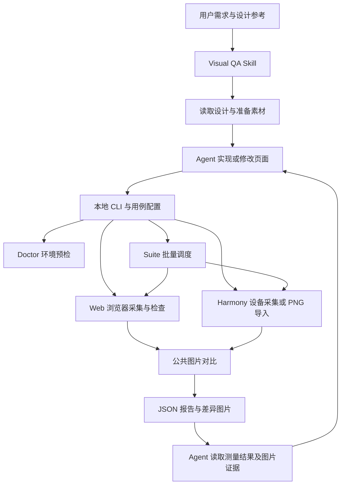
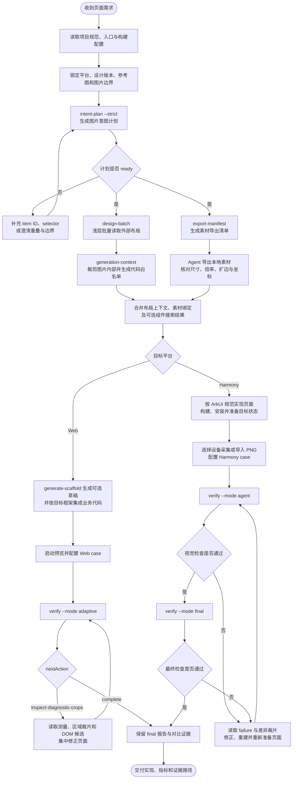

# Visual QA 技术说明

> 基于 2026-09-07 当前仓库实现编写。本文介绍使用的技术、模块职责、运行流程与能力边界；命令参数和安装方式见 [README](README.md)。

## 1. 项目做了什么

Visual QA 是一个面向设计还原的本地工具，由 **Skill 编排流程 + TypeScript CLI 执行检查** 组成。

它把 Pixso 设计稿或用户提供的参考图作为视觉基准，采集实际页面截图，计算差异并生成报告。AI Agent 根据报告中的测量结果和局部图片修改页面，再次运行验收，形成迭代闭环。

当前支持两类页面：

| 平台 | 已实现能力 | 验收范围 |
|---|---|---|
| Web / H5 | 浏览器截图、资源就绪检查、DOM 测量、样式规则检查、视觉结构检查、图片对比 | 当前用例和模式启用的浏览器检查 |
| HarmonyOS ArkUI 原生页面 | 设备检测、Ability 启动、设备截图、PNG 导入、稳定性检查、区域裁切、图片对比 | 原生页面截图视觉验收 |

核心价值是提供可重复执行的测量与图片证据，帮助定位页面与设计稿的偏差。它不替代业务功能测试，也不保证像素接近就代表页面实现正确。

## 2. 使用了哪些技术

以下版本为 `package.json` 声明范围，实际安装版本由 `package-lock.json` 锁定。

| 技术 | 声明版本 / 来源 | 在项目中做什么 |
|---|---|---|
| Node.js | `>=18` | 运行 CLI、读写文件、管理子进程、调用 Git 和 hdc |
| TypeScript | `~5.9.3` | 定义用例、测量和报告类型，编译 CLI；启用 strict 模式 |
| ES Modules | `type: module`、NodeNext | 组织模块和导出公共函数 |
| Playwright | `^1.55.0` | 启动或连接浏览器，访问页面、执行 DOM 查询和截图 |
| Chrome / Chromium / Edge | 本机浏览器或 Playwright 浏览器 | 实际渲染 Web 页面；默认本机 Chrome |
| pixelmatch | `^7.1.0` | 比较对应像素，输出差异像素数量和差异遮罩 |
| ssim.js | `^3.5.0` | 计算结构相似度，补充像素差异指标 |
| pngjs | `^7.0.0` | 解码、编码 PNG，裁切图片、读取 RGBA 像素、拼接诊断图 |
| Git CLI | 本机工具 | 获取代码版本、变更文件，支持 Web 变更区域选择与缓存指纹 |
| SHA-256 | Node.js `crypto` | 对设计图、文件内容和配置生成指纹 |
| hdc + 设备 UITest | Harmony/OpenHarmony 工具链 | 枚举设备、执行远端命令、采集设备截图并拉取文件 |
| Node.js Test Runner | `node:test`、`node:assert` | 单元测试、模拟设备流程和真实浏览器回归 |
| Python 标准库 | 分发脚本 | 复制插件、生成 ZIP、计算校验值及处理分发安装 |
| Pixso MCP | Agent 环境中的外部工具 | 读取设计信息、截图和导出素材；由 Skill 按可用能力调用 |
| internal-components MCP | 可选外部工具 | 在允许的项目范围内检索可复用组件 |
| Computer Use | 可选 Agent 工具 | 操作已确认对应设备的投屏或模拟器窗口，进入目标页面 |

项目本身没有内置模型 SDK、独立模型推理服务或 MCP Server。Pixso、组件搜索和 Computer Use 是 Agent 所在环境提供的能力，不是 CLI 内部直接调用的服务。

## 3. 整体架构



### 3.1 Skill：决定流程并使用外部工具

入口为 [SKILL.md](skills/visual-qa/SKILL.md)，平台细节分为 [Web 流程](skills/visual-qa/references/web.md) 和 [Harmony 流程](skills/visual-qa/references/harmony.md)。

Skill 负责识别目标页面的平台，读取项目规范，编排设计读取、组件复用、页面实现、构建运行、验收和修改。它还规定图片节点应保留为图片、不能为了通过验收替换设计基准或放宽阈值等工作约束。

Skill 是 Agent 的工作说明，不是常驻程序。自动修改代码、查看图片及操作界面由宿主 Agent 完成。

### 3.2 CLI：执行可测量的任务

[cli.ts](src/cli.ts) 解析参数并调度模块。[run.mjs](scripts/run.mjs) 检查 Node.js 和插件初始化状态，再启动编译后的 CLI，保留调用者的工作目录。

CLI 输入主要是 JSON 用例、PNG 文件和命令行选项，输出包括 JSON 摘要、报告、截图及差异图。它不直接执行 Pixso MCP 调用或大模型推理。

### 3.3 平台模块：提供不同的采集证据

Web 可以访问浏览器 DOM、计算样式和控制台，因此支持结构化检查。Harmony 原生使用设备截图，当前没有原生组件测量实现。

两个平台共用图片对比模块，但使用不同的采集结果和报告类型。这样可以保留平台差异，避免把 Harmony 不支持的检查误写成“通过”。

### 3.4 从设计输入到页面交付的流程

下面的流程描述 Agent、外部设计工具与本地 CLI 如何协作。它不是一个 CLI 命令内部的调用链；其中读取 Pixso、导出素材、修改业务代码和操作设备由 Agent 完成，CLI 负责生成计划、整理上下文和执行可重复的验收。



流程中的关键闸门是：图片意图未达到 `ready` 前不进入代码生成；图片节点只作为完整素材消费；Web 的 `adaptive` 只有自动完成 final 验收后才返回 `complete`；Harmony 必须在同一目标状态下重新采集并完成 final 验收。任何失败都回到实现或页面准备阶段，不能通过替换设计基准、放宽阈值或复用旧报告绕过。

## 4. 主要源码与职责

| 文件 | 职责 |
|---|---|
| [types.ts](src/types.ts) | 定义 Web/Harmony 用例、阈值、测量、缓存和报告类型 |
| [config.ts](src/config.ts) | 校验配置、补充默认值、解析相对于用例的路径、按平台分流 |
| [cli.ts](src/cli.ts) | 命令路由、参数解析、摘要输出、退出码 |
| [capture.ts](src/capture.ts) | Web 浏览器连接、上下文创建、导航、检查与截图 |
| [readiness.ts](src/readiness.ts) | Web 字体、图片、页面尺寸稳定性及等待条件 |
| [measure.ts](src/measure.ts) | DOM 几何与样式测量、设计契约比较、轮次差量 |
| [measure-case.ts](src/measure-case.ts) | 不生成截图的 Web 测量流程与历史记录 |
| [structure.ts](src/structure.ts) | 单图、分层图片的结构和位置关系检查 |
| [css-rules.ts](src/css-rules.ts) | Web 布局兼容与可疑样式规则检查 |
| [compare.ts](src/compare.ts) | PNG 对比、SSIM、差异区域定位和诊断图生成 |
| [verify.ts](src/verify.ts) | 公共验收入口、Harmony 分流和 Web 验收汇总 |
| [platforms/harmony/device.ts](src/platforms/harmony/device.ts) | hdc 调用、设备探测、目标选择及设备错误 |
| [platforms/harmony/capture.ts](src/platforms/harmony/capture.ts) | 原生页面准备检查、截图、稳定性判断和裁切 |
| [platforms/harmony/verify.ts](src/platforms/harmony/verify.ts) | Harmony 对比流程、能力范围与阶段错误报告 |
| [intent-plan.ts](src/intent-plan.ts) | 将设计节点或标注区域整理成图片意图计划 |
| [export-manifest.ts](src/export-manifest.ts) | 生成素材导出清单、尺寸策略及回退操作描述 |
| [cache.ts](src/cache.ts) | 哈希、Git 状态、变更区域映射、缓存读写 |
| [agent-context.ts](src/agent-context.ts) | 汇总设计、素材、规则和验收摘要，减少重复读取 |
| [doctor.ts](src/doctor.ts) | 预检 Node、用例、设计图、输出权限、浏览器和 Harmony 设备 |
| [suite.ts](src/suite.ts) | 批量调度用例，隔离 case 缓存并输出 JSON/JUnit/HTML 汇总 |

## 5. 设计信息与素材处理

### 5.1 图片意图计划

`intent-plan` 优先接收明确的 Pixso item ID，也支持从带红框的标注图识别矩形区域。红框识别使用颜色阈值、红色优势和边缘覆盖等图像规则，不是大模型识图。

计划中的区域可以标记为：

| 模式 | 含义 |
|---|---|
| `single-image` | 整个区域作为一张图片 |
| `layers` | 底图与叠加图片分别处理 |
| `dom-text` | 不作为图片导出，交由页面文字实现流程处理 |
| `ignore` | 跳过该区域 |
| `review` | 存在歧义，待确认后处理 |

计划记录节点 ID、区域坐标、图片角色以及未解决的歧义。红框识别提供区域线索，不能独立证明该区域应采用什么实现方式。

### 5.2 导出清单

`export-manifest` 把意图计划转换为需要使用的素材清单，包含目标文件、格式、倍率和对应 Pixso 操作。默认导出倍率为 3x，并跳过不使用的素材。

对具备设计坐标的位图，清单可描述期望尺寸和尺寸不符时的回退方式：导出画板后按准确坐标裁切，以处理阴影等效果引起的扩边。

**生成清单不等于完成导出。** 实际调用 Pixso、下载素材和执行清单中的回退操作由 Agent 结合外部工具完成。

## 6. Web 验收如何工作

### 6.1 采集实际页面

Web 用例指定 URL、viewport、DPR 和设计图。采集模块按配置创建浏览器上下文，设置语言、时区、颜色模式和 reduced motion。

流程为：

1. 启动本机浏览器，或复用调用者传入的 Browser / 浏览器端点。
2. 打开页面，收集 console error 和 pageerror。
3. 注入样式，降低动画、过渡、光标及平滑滚动对截图的影响。
4. 执行就绪检查、结构检查、CSS 规则和可选 DOM 测量。
5. 截取实际页面，记录各阶段耗时。

浏览器端点使用 Playwright `chromium.connect`，不能直接把任意 DevTools/CDP 地址当作兼容端点。复用浏览器时，每轮仍创建独立上下文；调用者持有的浏览器不会由采集函数关闭。

### 6.2 页面就绪检查

| 检查 | 实现方式 | 实际边界 |
|---|---|---|
| 网络空闲 | 尝试等待 `networkidle` | 超时本身不直接判失败；明确 readyExpression 时跳过此等待 |
| 指定元素 | Playwright locator 等待可见 | 仅针对配置的元素 |
| 自定义就绪表达式 | `waitForFunction` | 可以表达业务数据已准备完成等条件 |
| 字体 | `document.fonts.ready` | 字体集合加载状态，不证明使用了设计要求的字体 |
| 图片 | 遍历 `document.images`，检查加载与解码 | 不覆盖所有 CSS 背景图或 Canvas 内容 |
| 布局稳定 | 多帧比较文档滚动尺寸和 body 尺寸 | 不会遍历所有元素，不证明内部位置或画面像素完全稳定 |

字体和图片等待并行执行，使用剩余时间预算。就绪检查的意义是减少过早截图，不能把它理解成完整业务状态检查。

### 6.3 DOM 测量与设计契约

`contract` 用选择器定义目标元素及预期数值。测量通过一次 `page.evaluate` 批量读取：

- 匹配数量和可见性。
- `getBoundingClientRect` 获取的边界，加上滚动偏移得到页面坐标。
- `getComputedStyle` 获取的指定 CSS 属性。

检查支持元素位置、宽高、样式，以及 `gapX`、`gapY`、`alignLeft`、`alignTop`、`centerX` 等元素关系。几何数值采用 CSS 像素；数值型样式期望只对实际 `px` 值做数值比较。

测量历史会记录新增、解决、改善、恶化和未变化的问题。连续两轮没有改善或解决问题时，标记建议查看图片，帮助 Agent 从纯数值调整切换到视觉检查。

### 6.4 结构与 CSS 规则

结构检查验证用例明确声明的单图或复合图片区域，包括可见子节点、底图与叠加图的重叠、溢出和上下层关系。

CSS 规则检查 Flex 偏好、Grid/gap 限制、自适应页面、可疑定位和定位上下文等问题。这些是项目内置的兼容性与实现约定，不代表 Grid、gap 或绝对定位在所有项目中都不合适；规则可以通过用例配置。

Web 完整验收通过要求图片对比通过、基础就绪状态符合要求、没有采集到的控制台错误，并且所有启用且要求阻断的测量/结构/CSS 检查通过。

## 7. Harmony 原生验收如何工作

### 7.1 设备检测与选择

`harmony-devices` 使用 `hdc list targets` 枚举目标，再通过 shell 探测连接是否可用，并尝试读取设备 model 和 deviceType。

选择规则：指定设备优先；auto 模式只有一个可用设备时自动选择；多个可用设备要求明确 ID；没有可用设备时报告缺失。

当前设备 `kind` 记录为 `unknown`。USB/TCP 连接方式和 phone/tablet 类型不能可靠证明它是真机还是模拟器。报告保留实际设备 ID 与可获取的元信息，不伪造分类。

hdc 通过 Node.js `execFile` 和参数数组调用。适配器同时检查进程异常与文本失败提示，因为部分工具可能在返回错误文本时仍使用退出码 0。

### 7.2 页面准备与 Computer Use

| navigation | 执行方式 |
|---|---|
| `manual` | 用户或已有工作流已进入目标页面，本轮通过 `--page-ready` 声明准备完成 |
| `computer-use` | Agent 检查可用工具，操作与目标设备对应的投屏/模拟器窗口，准备完成后传 `--page-ready` |
| `configured` | CLI 通过 `aa start -b ... -a ...` 启动指定的已安装 Ability |

Computer Use 负责进入页面，hdc 负责采集原始截图。`navigation: computer-use` 本身不会启动插件，也不会证明窗口已经操作成功。

configured 每轮都会启动 Ability，适合启动后即为目标页的情况。构建、签名、安装和复杂导航仍由 Agent 按目标项目配置处理，不在 CLI 中猜测实现。

### 7.3 截图与稳定性

设备截图使用以下工具链：

```text
hdc -t <deviceId> shell uitest screenCap -p <本轮设备临时路径>
hdc -t <deviceId> file recv <本轮设备临时路径> <本地路径>
```

设备临时文件位于 `/data/local/tmp`，文件名带随机标识。每次截取前清理本轮路径，避免新截图失败时误用上一帧；结束时清理本轮设备临时文件。

默认在截图阶段 15 秒内获得两张连续一致的内容区截图，采样之间等待 500ms。判断比较 PNG 解码后的尺寸和 RGBA 数据，不使用视觉阈值放宽“稳定”的定义。

持续动画、时间变化或加载状态可能导致失败。整屏比较与明确内容区比较均可使用，但裁切范围应由设计范围决定，不能为通过验收排除业务差异。

### 7.4 PNG 导入与坐标对齐

用例配置 `harmony.screenshot` 时，直接读取该 PNG，不检测设备、不启动页面、不检查连续帧稳定性。设备失败不会自动回退到导入图片。

`capture.scope` 支持 `screen` 和 `region`。region 使用原始截图的物理像素坐标，必须完整位于图片范围内。流程保留原图、原始尺寸和裁切位置，输出裁切后的实际图。

设计图与实际图尺寸必须一致，不做隐式缩放。设计倍率、ArkUI vp/fp、设备物理像素与系统栏范围的映射，需要在准备基准和用例时确定。

### 7.5 原生报告与错误

报告明确声明：`scope: native-screenshot-visual-only`。

DOM/CSS 标记为不适用，原生结构和组件测量标记为未实现，字体、图片资源和控制台标记为未检查。导入图与设备图的来源分别记录。

失败按阶段记录到 `failure`：device、preparation、capture、alignment、comparison。每轮使用独立证据目录，避免之前的 actual/diff 被当作本轮结果。Harmony 每次重新读取设备状态或导入图片，不复用 verification 缓存。

## 8. 图片对比与差异定位

### 8.1 两种指标

对比前通过 pngjs 读取设计图和实际图，要求宽高一致。

```text
差异比例 = 差异像素数量 / 本次参与比较的像素数量 × 100%
```

| 参数 | 默认值 | 含义 |
|---|---|---|
| `pixelThreshold` | 0.1 | Pixelmatch 的像素差异判定阈值，不是允许 10% 的像素不同 |
| `maxMismatchPercent` | 1.5 | 允许的最大差异像素占比，即 1.5% |
| `minSsim` | 0.98 | 启用 SSIM 时要求达到的最低结构相似度 |

启用 SSIM 时，两个条件必须同时满足：差异比例不超过上限，SSIM 不低于下限。quick 模式不计算 SSIM，仅按像素差异条件判断图片对比。

SSIM 使用库中的 fast 模式。按多个指定区域比较时，相似度按参与区域的像素数量加权。指标反映图片接近程度，不直接给出业务语义或问题根因。

### 8.2 差异区域和诊断图

差异定位先从 Pixelmatch 的差异遮罩提取变化像素，再进行八邻域连通区域搜索，计算区域边界。随后合并相距较近的区域，按差异像素数排序，保留指定数量的重点区域。

诊断图将同一局部的设计图放在左侧、实际图放在右侧，中间添加分隔线。Agent 可先看局部证据，而不必每轮读取两张完整大图。

这些区域定位来自本地图像算法；解释“为什么错”和决定“怎么改”仍由 Agent 结合源码、测量与图片完成。

## 9. 验收模式和缓存

| 模式 | 公共图片处理 | Web 行为 | Harmony 行为 |
|---|---|---|---|
| quick | 像素对比；跳过 SSIM 和区域分析 | 缩短就绪等待，跳过结构/CSS，仍保留配置的契约测量 | 保留设备采集和稳定性检查 |
| agent | 像素、SSIM、重点区域分析 | 标准检查；按诊断条件生成局部裁图，默认最多两个 | 视觉失败时生成局部裁图，默认最多两个 |
| final | 像素、SSIM、区域分析 | 标准检查及完整报告；当前 Web 分支不自动生成局部诊断裁图 | 视觉失败时也生成局部裁图，默认最多三个 |

Web 在测量仍未通过时，可能先要求修复数值问题；当测量通过或连续迭代停滞时，再提示读取差异图片。因此 agent 模式并非任何失败都会生成裁图。

Web 缓存包含设计哈希、素材信息、Git 代码指纹、用例及模式指纹。quick/agent 在没有设计契约时可能默认复用验证结果；可通过 `--no-cache` 禁止验证复用。源码和设计未变化不等于远端数据、时间或运行环境未变化，有这些输入变化时应重新采集。

`--changed-only` 根据显式的源码路径模式与截图区域映射选择比较范围；没有匹配区域时回到整图比较。它不通过代码自动推断元素坐标。Harmony 当前不支持该选项。

`agent-context` 将设计、素材、规则及验收摘要写成 JSON，并按输入文件指纹复用。它减少重复上下文读取，不包含模型调用。

## 10. 命令与输出

| 命令 | 作用 |
|---|---|
| `doctor` | 执行环境和用例预检，不运行页面验收 |
| `suite` | 批量执行 Web/Harmony 用例并生成 JSON、JUnit、HTML 汇总 |
| `capture` | Web 截图与采集；当前命令没有 Harmony 独立截图入口 |
| `compare` | 直接比较两张本地 PNG |
| `measure` | Web DOM 契约测量，不生成页面截图 |
| `verify` | 根据用例平台执行 Web 或 Harmony 验收 |
| `harmony-devices` | 检测 Harmony 可连接目标 |
| `browser-server` | 启动可供复用的 Playwright 浏览器服务 |
| `intent-plan` | 生成图片意图计划 |
| `export-manifest` | 生成素材导出操作清单 |
| `agent-context` | 生成供 Agent 使用的精简上下文 |

Web 通常输出 `actual.png`、`diff.png`、`report.json`，以及按需生成的 diagnostics 和 measurement-history。Harmony 输出目录示意：

```text
artifacts/harmony-page/
├── report.json                 # 最新一轮结果
└── capture-<本轮标识>/
    ├── raw.png                 # 原始截图
    ├── actual.png              # 整屏或明确裁切后的图片
    ├── diff.png                # 成功执行对比后生成
    └── diagnostics/            # 按模式和失败情况生成
```

未完成某一步时，不应假定其对应文件存在，应以本轮报告 artifacts 为准。

验收通过通常返回退出码 0，验收失败返回 1，参数、配置或未捕获的执行错误返回 2。Harmony 已捕获的设备及截图流程错误会写入失败报告并返回 1；`harmony-devices` 无可用设备返回 1，工具调用错误返回 2。

## 11. 配置示例

Web 用例包含页面 URL、设计 PNG 和 viewport：

```json
{
  "name": "web-page",
  "platform": "web",
  "url": "http://localhost:5173",
  "designImage": "./design.png",
  "outputDir": "./artifacts/web-page",
  "viewport": { "width": 375, "height": 812, "deviceScaleFactor": 1 }
}
```

Harmony 用例不填 URL 或 viewport，沿用 `designImage` 字段：

```json
{
  "name": "native-page",
  "platform": "harmony",
  "designImage": "./design.png",
  "outputDir": "./artifacts/native-page",
  "harmony": {
    "deviceId": "auto",
    "navigation": "manual",
    "capture": { "scope": "screen" }
  }
}
```

页面确已准备完成后执行：

```bash
node /absolute/path/to/visual-qa/scripts/run.mjs verify \
  --case /absolute/path/to/project/native-page.json \
  --page-ready --mode agent
```

完整样例见 [Web 用例](cases/example.json)、[设计契约用例](cases/contract.example.json)、[Harmony 设备用例](cases/harmony.example.json)、[Harmony 导入用例](cases/harmony-import.example.json) 和 [批量 suite](cases/suite.example.json)。

## 12. 打包、测试与当前限制

插件携带 Skill、CLI 源码、用例和运行脚本。Python 分发脚本可生成本地插件包或 Antigravity 分发包，具体安装流程见 [INSTALL](INSTALL.md)。打包不代表已经在用户环境安装或启用插件。

常用开发检查：

```bash
npm run build
npm test
npm run test:browser
```

以上命令在插件目录执行。构建使用 TypeScript 编译器；普通测试使用 Node.js Test Runner；浏览器回归使用实际 Chrome。

普通测试覆盖核心计算、配置、缓存、Doctor、Suite 和 Harmony 模拟流程；浏览器回归使用实际 Chrome。具体数量以当前 `npm test` 和 `npm run test:browser` 输出为准，避免文档中的固定计数随新增用例失效。

当前仍有以下边界：

- 未完成真实 Harmony 设备和投屏窗口的端到端联调；当前开发会话 PATH 中未发现 hdc。模拟测试通过不代表所有系统版本和设备都兼容。
- 原生组件树、原生样式测量、运行时日志、多设备批量验收和长页面拼接尚未实现。
- Computer Use 是可选流程能力，需要运行环境存在对应工具和可控制窗口。
- Web 就绪与规则检查覆盖有限；CSS 背景图、Canvas 内容、内部动画或业务状态仍可能需要额外条件与人工/Agent 检查。
- 图片对比需要先统一页面状态、字体、内容范围、倍率和尺寸；工具不会自动消除这些环境差异。
- 未内置云端服务、数据库或模型推理服务。报告与缓存落在本地，外部设计与 AI 能力由 Agent 环境提供。
